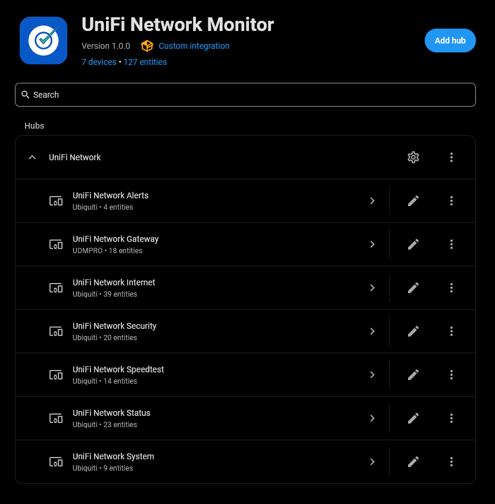
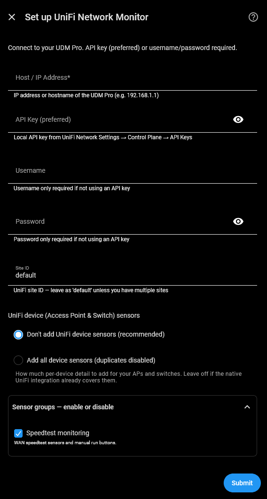
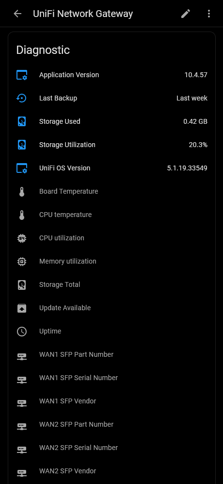
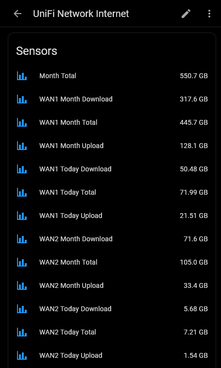
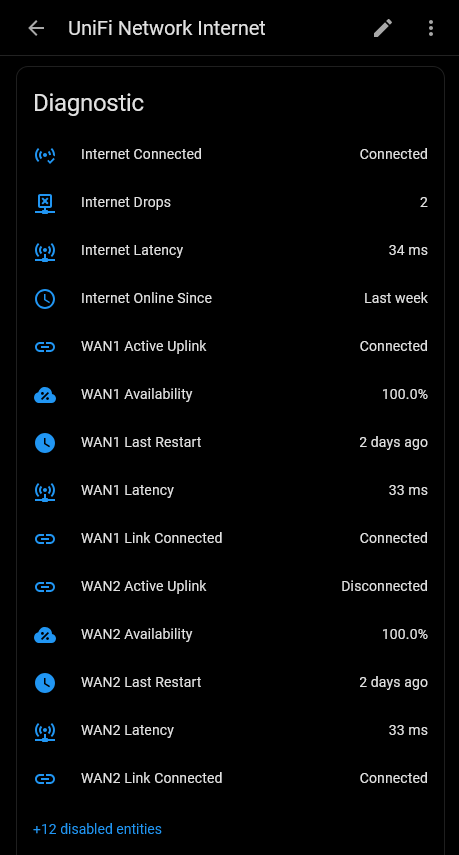
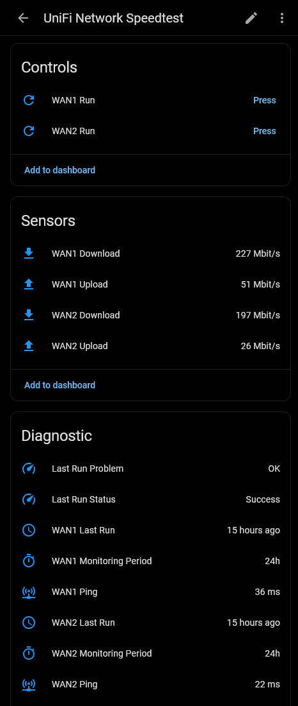
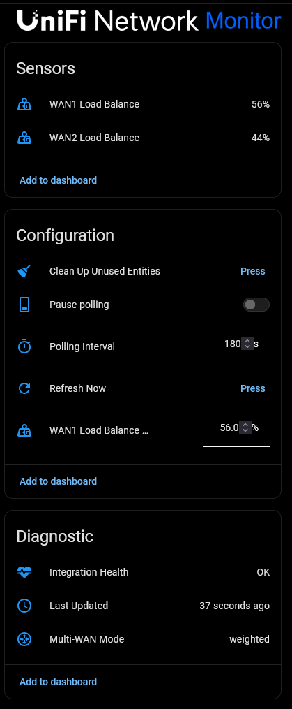
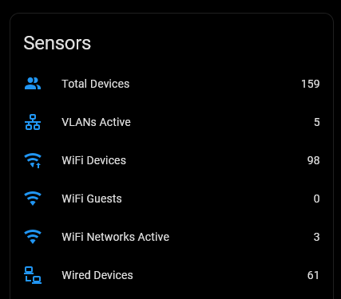
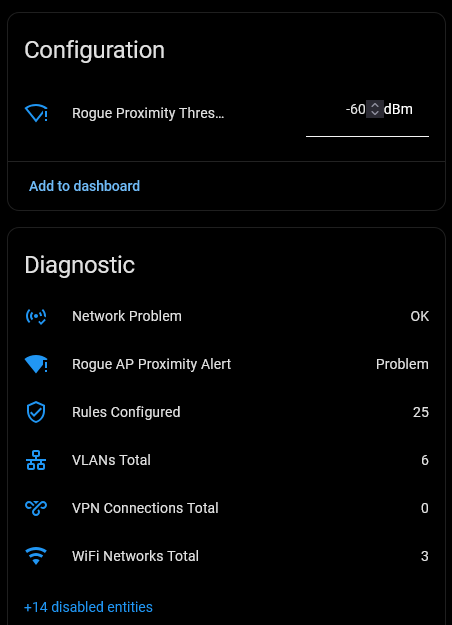
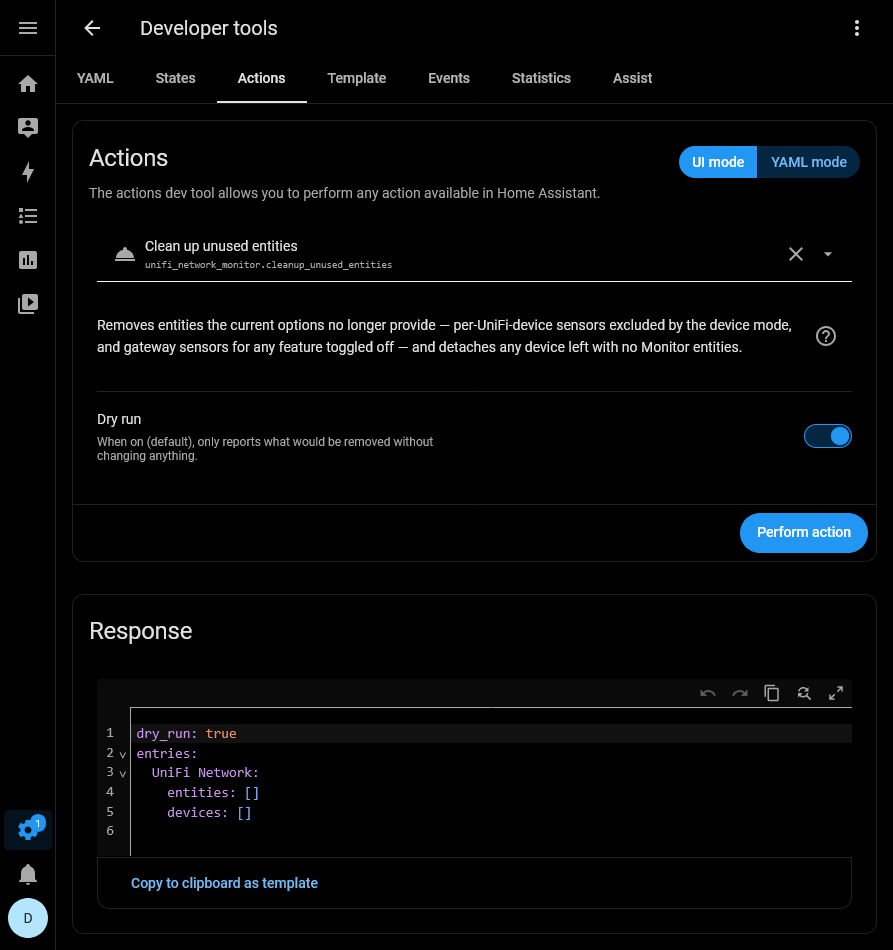

# UniFi Network Monitor for Home Assistant

[](https://hacs.xyz/) [](https://hacs.xyz/docs/faq/custom_repositories) [](https://github.com/PlayFaster/ha-unifi-network-monitor/releases) [](https://opensource.org/licenses/Apache-2.0) [](https://github.com/PlayFaster/ha-unifi-network-monitor/actions/workflows/validate.yaml)  [](https://github.com/PlayFaster/ha-unifi-network-monitor/commits/main)

A Home Assistant integration to connect to your **Ubiquiti UniFi Network** via your UniFi Gateway (e.g. UDM Pro or similar), designed to run in conjunction with and be complementary to, the official Home Assistant [UniFi Network Integration](https://www.home-assistant.io/integrations/unifi/), but it does not require it.

- The focus is on providing information that the core integration does not, such as: Internet data usage, Speedtest data, WAN latency and IP address, Rogue Access Point insights and summary stats.
- It works in single or dual WAN mode. In dual WAN mode, it provides per WAN (WAN1, WAN2) info for Internet data usage; Speedtest results; latency; IP addresses and load-balancing status, and if set, balance-weight, plus the ability to change load balancing weight.
  - In single WAN mode, the WAN2 sensors will be unknown.
- This integration does not provide any client tracking (i.e. device trackers) beyond summary counts, as that is handled by the core Integration.

> [!NOTE]
>
> **Is this the right integration for you?**
>
> - **If you run a UniFi Network on a UDM Gateway** and want infrastructure-level monitoring — data usage, WAN/internet quality, speedtests, and network security info — directly in Home Assistant, then **yes**.
> - It is designed to run **alongside** the official Home Assistant UniFi Network integration. Where both cover the same physical device, entities **merge onto one device card** — no duplicate device entries.
> - **This integration is for you if** you want:
>   - **Internet Data usage** — Daily and monthly download, upload and totals, per WAN if in dual WAN mode.
>   - **Speedtest tracking** — per-WAN download/upload/ping history, plus one-click manual runs.
>   - **Load Balancing** - Status, weights and weight setting
>   - **WAN Stats** - Per WAN latency, status, assigned name, internal and external IP address and uptime.
>   - **Rogue AP Info** — rogue access-point detection with a configurable proximity alert.
>   - **Gateway diagnostics** — OS and Application version, last backup, and storage use.
>
> This project is developed and tested on the **UDM Pro** but is expected to work with other UniFi OS gateways.

## 📋 Table of Contents

- [UniFi Network Monitor for Home Assistant](#unifi-network-monitor-for-home-assistant)
  - [📋 Table of Contents](#-table-of-contents)
  - [🔧 Compatibility \& Tested Devices](#-compatibility--tested-devices)
  - [🎯 Use Cases](#-use-cases)
  - [✅ Features](#-features)
  - [🔍 What You Get](#-what-you-get)
  - [📸 Screenshots](#-screenshots)
  - [📡 Rogue Access Point Monitoring](#-rogue-access-point-monitoring)
  - [💡 Example Automations](#-example-automations)
  - [📥 Installation](#-installation)
  - [🔧 Configuration](#-configuration)
  - [🧹 Actions (Services)](#-actions-services)
  - [🔩 Under the Hood - Technical Architecture](#-under-the-hood---technical-architecture)
  - [❓ FAQ \& Troubleshooting](#-faq--troubleshooting)
  - [❗ Known Limitations /❔ What's Missing?](#-known-limitations--whats-missing)
  - [❌ Removal](#-removal)
  - [📝 Maintenance Status](#-maintenance-status)
  - [🤝 Contributors \& Acknowledgements](#-contributors--acknowledgements)
  - [📄 License](#-license)

## 🔧 Compatibility & Tested Devices

**📟 Gateway Hardware:**

- **Fully Tested**:
  - **UDM Pro** — tested on **UniFi OS `5.1.19`** with **Network application `10.4`**.
- **Expected Compatible**: Other UniFi OS gateways running the Network application, which should include the UDM range, and possibly others. These are untested.
- **Access Points & Switches**: Adopted UniFi APs and switches **optionally** are discovered automatically for per-device sensors (see [Configuration](#-configuration)).
- **Not Supported**: Non-UniFi hardware; setups without a UniFi OS gateway.

**🏠 Home Assistant and UniFi Versions:**

- Minimum: Home Assistant **2024.8.0**
- Minimum Python: **3.12+** (this is built into and handled by HA, but relevant for non-standard installs).
- Minimum UniFi OS: **3.2.7+** (required for all API endpoints). OS 3.0+ will work with reduced functionality.
- Minimum UniFi Network Application: **8.1.113+** - Required for API Key authentication and full functionality. Network **7.4.x+** will work with reduced functionality.

**🌐 Network:**

- Local network access to the gateway's UniFi Network API is required. No cloud account or internet access is needed.
- **Authentication** — see [initial set-up](#-initial-setup), use either:
  - A **local API key** (preferred; UniFi OS 3.2.7 and Network Application 8.1.113 and later), or
  - A local **Username / password** for the controller (cookie-based session)

## 🎯 Use Cases

- **Data-Cap Management**: Watch daily and monthly WAN usage and if desired, create automations to get notified as you approach an ISP data limit.
- **WAN/dual-WAN & Internet Quality**: Monitor WAN1/WAN2 up/active status, latency, uptime, and the active routing interface; drive failover automations and dashboards.
- **Speedtest History**: Keep a per-WAN record of speedtests run directly from the gateway - download/upload/ping. Trigger on-demand tests from HA.
- **Network Security Awareness**: Detect nearby **rogue access points** and raise a **Proximity Alert** when an unknown AP is close (strong signal) — useful for spotting rogue/evil-twin APs or resetting smart home devices.
- **Load Balancing Status**: In multi-WAN mode, shows if operating in failover or load-balancing mode. If using load-balancing, shows the weighted percentages and allows changing them. Useful if one of your ISPs has variable performance.
- **Augment the Official Integration**: Runs well alongside the official HA UniFi Network integration to provide additional information. Also works without the official integration present and, optionally, can provide additional info on UniFi devices like Access Points and Switches.

## ✅ Features

### 🌐 WAN, Internet & Data Usage

- **Data Usage**: Daily and monthly per-WAN download/upload/total (i.e. GB of data used).
- **Dual-WAN Status**: WAN1/WAN2 active-uplink and link-up indicators, uptime, latency, local/public IP addresses, and configured WAN interface names.
- **Multi-WAN Load Balancing**: Read and adjust the WAN1/WAN2 load-balance weight (always summing to 100%).

### ⚡ Speedtest

- **Per-WAN Results**: Download, upload, ping, and last-run time for WAN1 and WAN2.
- **Manual Runs**: **Run WAN1 Speedtest** and **Run WAN2 Speedtest** buttons trigger a test on the specific interface.

### 🛡️ Network Security & Health

- **Rogue AP Detection**: Count of rogue access points ( unknown APs), as detected by UniFi APs on the network, the **Strongest Rogue SSID** and **Strongest Rogue RSSI**, with the full rogue-AP list as an attribute. This lists Rogue APs detected within the last hour.
- **Proximity Alert**: A `PROBLEM` binary sensor that fires when the strongest rogue signal is at or above a user-set **Rogue Proximity Threshold** (dBm).
- **Subsystem Health**: Aggregated **Network Problem** indicator plus per-subsystem OK sensors (WAN, Internet/WWW, WiFi/WLAN, LAN).
- **WiFi, VLAN, VPN & Firewall**: Per-SSID broadcast status, per-VPN-tunnel status, VLAN and firewall-rule counts.

### 🖥️ Gateway & System Diagnostics

- **Firmware & Identity**: UniFi OS and Network application version, gateway model, and SFP transceiver diagnostics (SFP info is available but disabled by default).
- **Threat Management State**: IPS/IDS mode, Ad-blocking, and Honeypot status.
- **Hardware Metrics**: Storage utilization (enabled) plus CPU %, memory %, CPU & board (board=phy in core) temperatures, and uptime (disabled as they are also provided by the official integration, but available).

### 🔄 Dynamic Polling

- **Pause Polling**: A switch to halt polling temporarily.
- **Configurable Update Interval**: Adjust the scan interval from the HA UI or via automation (default `180` seconds, range `10` to `3600`).
- **Standard System Option**: Also honours Home Assistant's **System options > Enable polling for changes** toggle.

### 🎛️ Scoped Setup (Sensor Groups)

Choose at setup — and change any time via **Configure** — which groups of sensors are created. A disabled group both hides its sensors **and skips its API calls**:

- **Speedtest monitoring**, **WAN data-usage statistics**, **Security monitoring** (rogue APs / VPN / firewall).
  - These entities are specific to this integration and do not overlap with the official HA UniFi Network integration. However, if you don't want or need this info, turning them off removes entities from the UI and saves an API fetch.

- **UniFi device (Access Point & Switch) sensors** — none / AP Satisfaction Score only / all.
  - The integration is designed to work with the official HA UniFi Network integration, and provide minimal overlap. There is though the option to fetch info from all UniFi devices, should you wish.

### 🧹 Housekeeping

- **Clean Up Unused Entities**: A button (and matching action) to remove entities left behind after you turn a sensor group off. See [Actions](#-actions-services).

## 🔍 What You Get

This integration exposes its entities across several sub-devices — **Gateway**, **Internet**, **Speedtest**, **Status**, and **System** — plus, (if enabled) a dynamic sub-device per adopted **Access Point** and **Switch**. Each sub-device appears as its own card in Home Assistant, and entity IDs are prefixed accordingly (e.g. `sensor.unifi_network_gateway_last_backup`, `binary_sensor.unifi_network_status_network_problem`).

> [!NOTE]
>
> **Entity Visibility:** To keep your Home Assistant UI clean, many secondary/diagnostic entities are **disabled by default**. Enable them via the Entities tab in the device settings. Per-device (AP/switch) sensors are **not created at all by default** — opt in via [Configuration](#-configuration).

The counts below are from a **base install** on a UDM Pro — **no per-device (AP/switch) sensors**, with the **Speedtest**, **WAN data-usage**, and **Security monitoring** groups all **on**. That registers **116 base entities** regardless of anything else; only the enabled-by-default count changes:

- **Without the official HA Core UniFi integration:** **93 enabled / 23 disabled**. The `Enabled / Total` column below reflects this case.
- **With HA Core UniFi installed:** **87 enabled / 29 disabled** — six gateway diagnostics (CPU, Memory, CPU/Board Temperature, Uptime, Update Available) come in **disabled-by-default** because Core already surfaces the gateway (see [Coexistence](#-coexistence-with-the-official-unifi-integration)). So the Gateway row below reads **5 / 18** instead of 11 / 18.

Enable any disabled entity per-entity when you want it. Your totals also differ with your options and hardware (see [Configuration](#-configuration)).

| Sub-Device | Enabled / Total | Key Metrics |
| :-- | :-: | :-- |
| 🖥️ **Gateway** | 11 / 18 | CPU, Memory, CPU/Board Temperature, Storage (used/total/%), Uptime, UniFi OS & Network application versions, WAN1/WAN2 SFP diagnostics, Update Available |
| 🌐 **Internet** | 34 / 39 | WAN1/WAN2 active-uplink & link-up, Local/Public IPs, WAN names, availability, latency, last-restart/uptime, ISP name/org, and daily/monthly data usage; plus Internet Connected / OK, drops, latency, online-since |
| ⚡ **Speedtest** | 14 / 14 | WAN1/WAN2 Download, Upload, Ping, Last Run, Monitoring Period, Last Run Status/Problem; Run WAN1/WAN2 Speedtest buttons |
| 🛡️ **Status** | 22 / 33 | Rogue AP Count, Strongest Rogue SSID/RSSI, Proximity Alert (+ threshold), device/guest/WiFi/VLAN/VPN/firewall counts & per-item status, and the aggregate Network Problem + per-subsystem OK sensors (WAN/Internet/WiFi/LAN) |
| ⚙️ **System** | 12 / 12 | Multi-WAN mode, WAN1/WAN2 Load Balance, Threat-Management mode, Ad-blocking, Honeypot, Polling Interval, Pause Polling, WAN1 Load-Balance Weight, Refresh Now, Clean Up Unused Entities, Last Updated |
| 📶 **Per AP / Per Switch** | opt-in | **11 per AP** (Satisfaction Score + 2.4/5 GHz scores, Clients, Guests, 2.4/5 GHz Clients, CPU, Memory, Uptime, Update Available) · **6 per switch** (Clients, CPU, Memory, Uptime, Model, Update Available) — created only when you choose `Add all device sensors` |

> [!NOTE]
>
> **Per-device sensors scale with your hardware.** Choosing **Add all device sensors** creates one sub-device per adopted AP/switch: **+11 entities per AP** and **+6 per switch**. For example, a set-up with 8 APs + 12 switches adds 8×11 + 12×6 = **160 entities**.
>
> **Enabled-by-default depends on HA Core UniFi:** if you do **not** run the official HA Core UniFi integration, all of these per-device entities are created **and enabled**. If you **do** run Core UniFi, only the AP **Satisfaction Score** is enabled by default and the rest come in disabled (they'd duplicate what Core already provides — hence the "duplicates disabled" label).

---

> [!TIP]
>
> **Duplicate-of-core entities:** the per-device Clients / CPU / Memory / Uptime sensors keep their display name but get a `_mon` suffix on their entity ID (e.g. `sensor.<device>_clients_mon`), so when the official UniFi integration is also present you can tell Monitor's copy apart from Core's — on both APs and switches. Per-device entity IDs are prefixed with the **device name**, not `unifi_network_`.

---

> [!TIP]
>
> **Clean up your UI: Disable Unnecessary Devices or Entities**
>
> - If you never use the Status information, you may not need the Status sub-device.
> - Devices can be disabled from the main device page: (⋮ menu) > **Disable Device** which also disables all the device entities.
> - Individual entities can be disabled via their properties, or in bulk on the entities list page.

### 📊 Long Term Statistics (LTS)

Home Assistant records Long Term Statistics for a numeric sensor **only when it declares a `state_class`**. Sensors without one still show a live value and short-term history, but are not rolled up into LTS (no hourly min/mean/max, and they can't be used in the Statistics graph). Text, IP, version, mode and timestamp sensors are never LTS candidates.

**Almost every numeric sensor here is in LTS** — CPU/memory/temperatures, signal/RSSI, latency, availability, all counts (devices, clients, VLANs, VPNs, firewall rules, WiFi networks, rogue APs), **monthly** data usage, and speedtest download/upload.

The exceptions — **17** numeric sensors (14 base + 3 per-AP) that currently have **no `state_class`** and are therefore **excluded from LTS**:

| Sub-Device | Sensor | Entity ID (this install) | Unit |
| :-- | :-- | :-- | :-- |
| 🖥️ Gateway | Storage Total | `sensor.unifi_network_gateway_storage_total` | GB |
| 🌐 Internet | WAN1/WAN2 Today Download / Upload / Total (6) | `sensor.unifi_network_internet_wan{1,2}_today_{download,upload,total}` | GB |
| 🌐 Internet | WAN1 / WAN2 / Internet Uptime Duration (3) | `sensor.unifi_network_internet_wan{1,2}_uptime_duration`, `…_internet_uptime_duration` | s |
| ⚡ Speedtest | WAN1 / WAN2 Ping (2) | `sensor.unifi_network_speedtest_wan{1,2}_ping` | ms |
| ⚡ Speedtest | WAN1 / WAN2 Monitoring Period (2) | `sensor.unifi_network_speedtest_wan{1,2}_monitoring_period` | h |
| 📶 Access Point | Satisfaction Score / 2.4 GHz / 5 GHz (3) | `sensor.<ap>_satisfaction_score` (+ per-band) | % |

> [!TIP]
>
> **Want to add a sensor to Long Term Statistics?**
>
> Add a `state_class` override via [Manual Customization](https://www.home-assistant.io/integrations/homeassistant/#manual-customization) in your `configuration.yaml`. For example, to track Download Rate in LTS:
>
> ```yaml
> homeassistant:
>   customize:
>     sensor.unifi_network_speedtest_wan1_ping:
>       state_class: measurement
> ```
>
> Restart Home Assistant after saving. The sensor will begin accumulating LTS from that point forward.

## 📸 Screenshots

### Integration Overview



---

### Setup / Reconfig plus Gateway

| Setup and Reconfigure Screen | Gateway Diagnostic Info |
| :-: | :-: |
|  |  |

---

### Internet Info

| Internet Data Use | Internet Diagnostic Info |
| :-: | :-: |
|  |  |

---

### Speedtest and System Info

| Speedtest Info | System Info |
| :-: | :-: |
|  |  |

---

### Status Info

| Status Sensors | Status Config and Diagnostic Info |
| :-: | :-: |
|  |  |

---

### Clean Up Action (service)



---

## 📡 Rogue Access Point Monitoring

UniFi access points continuously scan the airwaves for nearby Wi-Fi networks. Any SSID broadcasting nearby that is not part of your managed UniFi network is reported by the controller as a "Rogue Access Point".

This integration filters these detections to show only active devices seen within the **last hour** (the default query window) and exposes them through a set of helpful entities under the **Status** sub-device:

- **Rogue Access Points (`sensor.*_rogue_access_points`)**: A count of the number of unique rogue APs detected nearby in the last hour.
- **Strongest Rogue SSID (`sensor.*_strongest_rogue_ssid`)**: The name (SSID) of the rogue network with the strongest (least negative) signal.
  - _Additional Info (Attributes)_: This sensor carries a `rogue_aps` list attribute containing detailed records of every detected rogue network, including their BSSID (MAC), channel, signal strength (RSSI), manufacturer (OUI), age (rendered dynamically in minutes or hours), and the friendly name of your UniFi AP that detected it.
- **Strongest Rogue RSSI (`sensor.*_strongest_rogue_rssi`)**: The signal strength (in dBm) of the strongest rogue network.
- **Rogue Proximity Threshold (`number.*_rogue_proximity_threshold`)**: A slider entity in Home Assistant (defaulting to `-60` dBm) that lets you define what signal level is considered "close".
- **Rogue AP Proximity Alert (`binary_sensor.*_rogue_ap_proximity_alert`)**: A safety binary sensor (configured with `device_class: problem`). It turns `on` (triggers a "Problem" state) when the strongest rogue AP's RSSI is equal to or higher than your custom Proximity Threshold (e.g. `-50` dBm is higher/closer than `-60` dBm).

### ❓ Why is this useful?

1. **Security Awareness**: Detect if someone has plugged in an unauthorized router nearby, or is running an "evil twin" AP mimicking common SSIDs.
2. **Perimeter Monitoring / Smart Home Troubleshooting**: Since smart home devices occasionally fail and revert to their own internal Wi-Fi broadcast setup (e.g. a Shelly plug broadcasting `shellyplug-s-XXXXXX` when disconnected), this alert can notify you immediately if a smart plug or IoT device has dropped offline and is broadcasting its setup SSID.

### ⚙️ How to use it

1. Look at the typical signal levels of your neighbors' Wi-Fi networks in your dashboard.
2. Set your **Rogue Proximity Threshold** slightly above this normal background level (e.g. if neighbors average `-75` dBm, set the threshold to `-65` or `-60` dBm).
3. Set up an automation to send a notification to your phone when the **Proximity Alert** binary sensor turns `on`. (See the example below).

---

## 💡 Example Automations

> [!NOTE]
>
> Entity IDs are derived from your gateway/sub-device names and **will differ between installs** (e.g. `sensor.unifi_network_status_...`). Use the entity picker in the Automation editor rather than copying the IDs below verbatim. The examples are illustrative.

---

> [!NOTE]
>
> The Automation examples below use the `note:` functionality introduced in Home Assistant 2026.6 as a way to document/comment Automations that is permanent - NOT stripped out by the editor. If using an older version of Home Assistant you may need to remove the `notes:` sections

### 🛡️ Rogue AP Proximity Alert

Notify when an unknown access point is detected close by (signal at/above your threshold).

```yaml
alias: "UniFi: Rogue AP Nearby"
triggers:
  - trigger: state
    entity_id: binary_sensor.unifi_network_status_rogue_ap_proximity_alert
    to: "on"
    for: "00:02:00"
    note: |
      Triggers if a rogue AP remains at or above the proximity threshold for 2 continuous minutes.
actions:
  - action: notify.mobile_app_your_phone
    data:
      title: "Rogue AP detected nearby"
      message: |
        Strongest rogue: {{ states('sensor.unifi_network_status_strongest_rogue_ssid') }} at {{ states('sensor.unifi_network_status_strongest_rogue_rssi') }} dBm.
    note: |
      Sends a phone notification containing the SSID and RSSI signal level of the closest rogue AP.
```

### 🌐 Internet / WAN Down Alert

```yaml
alias: "UniFi: Internet Down"
triggers:
  - trigger: state
    entity_id: binary_sensor.unifi_network_internet_internet_connected
    to: "off"
    for: "00:01:00"
    note: |
      Triggers if the internet connection is lost for at least 1 continuous minute to filter out transient drops.
actions:
  - action: notify.mobile_app_your_phone
    data:
      title: "Internet connection lost"
      message: "The UniFi gateway reports the internet is down."
    note: |
      Sends a push notification alerting that the internet is offline.
```

### 🚨 Monthly Data-Usage Alert

The example assumes usage sensors display in **GB**. Adjust the threshold/units to match your sensor.

```yaml
alias: "UniFi: High WAN Data Usage"
triggers:
  - trigger: numeric_state
    entity_id: sensor.unifi_network_internet_wan1_month_total
    above: 500 # GB
    note: |
      Triggers when total WAN1 monthly data consumption exceeds 500 GB.
actions:
  - action: notify.mobile_app_your_phone
    data:
      title: "UniFi Data Alert"
      message: "WAN1 monthly usage has exceeded 500 GB."
    note: |
      Sends a warning notification to help you avoid monthly ISP data cap surcharges.
```

### 🔁 Auto-Resume Polling

```yaml
alias: "UniFi: Auto-Resume Polling"
description: "Turn polling back on after 1 hour if it was manually paused."
triggers:
  - trigger: state
    entity_id: switch.unifi_network_system_pause_polling
    to: "on"
    for: "01:00:00"
    note: |
      Triggers if the system pause polling switch has been turned on for exactly 1 hour.
actions:
  - action: switch.turn_off
    target:
      entity_id: switch.unifi_network_system_pause_polling
    note: |
      Automatically resumes integration polling to restore dashboard telemetry updates.
```

### 💾 Backup Stale Alert

Notify if the gateway has not compiled a backup for more than 10 days.

```yaml
alias: "UniFi: Backup Stale Alert"
description: "Triggers if the latest UniFi controller backup is older than 10 days."
triggers:
  - trigger: template
    value_template: |
      {{ (as_timestamp(now()) - as_timestamp(states('sensor.unifi_network_gateway_last_backup'))) > (10 * 86400) }}
    note: |
      Checks if current time minus last backup time is greater than 10 days (864,000 seconds).
actions:
  - action: notify.mobile_app_your_phone
    data:
      title: "UniFi Backup Stale"
      message: "The last local backup is over 10 days old!"
    note: Sends a push notification warning that the backup is stale.
```

### ⚡ High Internet / WAN Latency

Alerts when any of the latency sensors exceed 100ms for consecutive poll periods (dynamic delay calculation).

```yaml
alias: "UniFi: High Internet Latency"
description: |
  Triggers if Internet, WAN1, or WAN2 latency goes above 100ms for at least
  two polling periods (or 2 minutes, whichever is longer).
triggers:
  - trigger: numeric_state
    entity_id:
      - sensor.unifi_network_internet_latency
      - sensor.unifi_network_internet_wan1_latency_avg
      - sensor.unifi_network_internet_wan2_latency_avg
    above: 100
    for:
      seconds: |
        {{ [120, (states('sensor.unifi_network_system_polling_interval') | int(180)) + 5] | max }}
    note: |
      Triggers when latency exceeds 100ms. The duration matches your custom poll interval
      plus a 5-second buffer (enforcing a minimum 120-second floor) to confirm the 
      latency remains high on the next consecutive poll.
actions:
  - action: notify.mobile_app_your_phone
    data:
      title: "High Latency Detected"
      message: |
        Latency alert triggered! Current Internet Latency: {{ states('sensor.unifi_network_internet_latency') }} ms.
    note: "Alerts you which interface is experiencing high latency."
```

### 👥 Guest Network in Use

Notify if there are active guests on the guest network for consecutive poll periods.

```yaml
alias: "UniFi: Guest Network Active"
description: |
  Triggers when guest users are active on the network for at least 
  two polling periods (or 2 minutes, whichever is longer).
triggers:
  - trigger: numeric_state
    entity_id: sensor.unifi_network_gateway_guest_users
    above: 0
    for:
      seconds: |
        {{ [120, (states('sensor.unifi_network_system_polling_interval') | int(180)) + 5] | max }}
    note: |
      Triggers when guest user count goes above 0. Evaluates the duration dynamically using
      the polling interval plus a 5-second buffer (minimum 120-second floor) to confirm
      guest activity persists across consecutive polls.
actions:
  - action: notify.mobile_app_your_phone
    data:
      title: "Guest Network Active"
      message: "There are currently {{ states('sensor.unifi_network_gateway_guest_users') }} active guest(s) on your Wi-Fi."
    note: Sends a push notification indicating active guest count.
```

### 🎛️ Optimize WAN Weight on High Latency

Shifts traffic load balance weight away from WAN2 if its average latency exceeds 150ms for consecutive poll periods.

```yaml
alias: "UniFi: Optimize WAN Weight on High Latency"
description: >-
  Shifts traffic load balance weight away from WAN2 if its average latency
  exceeds 150ms for consecutive poll periods.
triggers:
  - trigger: numeric_state
    entity_id: sensor.unifi_network_internet_wan2_latency_avg
    above: 150
    for:
      seconds: |
        {{ [120, (states('sensor.unifi_network_system_polling_interval') | int(180)) + 5] | max }}
    note: |
      Triggers when WAN2 latency averages above 150ms. Checks across consecutive polls
      (minimum 2 minutes) to ensure it is a sustained performance drop rather than a spike.
actions:
  - action: number.set_value
    target:
      entity_id: number.unifi_network_system_wan1_load_balance_weight
    data:
      value: 90
    note: |
      Sets WAN1 load balance weight to 90% (leaving only 10% for WAN2) to divert traffic
      away from the struggling connection.
```

### ⏱️ Trigger Diagnostic Speedtest

Automatically runs a WAN1 speedtest if internet latency spikes, helping to diagnose bandwidth degradation dynamically without scheduling constant speedtests.

```yaml
alias: "UniFi: Trigger Diagnostic Speedtest"
description: >-
  Automatically runs a WAN1 speedtest if internet latency spikes, helping to
  diagnose bandwidth degradation.
triggers:
  - trigger: numeric_state
    entity_id: sensor.unifi_network_internet_latency
    above: 100
    for:
      seconds: |
        {{ [120, (states('sensor.unifi_network_system_polling_interval') | int(180)) + 5] | max }}
    note: |
      Triggers when internet latency goes above 100ms. Dynamic delay ensures we wait for
      consecutive polls to confirm the network degradation is sustained before running.
actions:
  - action: button.press
    target:
      entity_id: button.unifi_network_speedtest_run_wan1_speedtest
    note: |
      Presses the Speedtest run button for WAN1 to capture current download/upload speeds
      while the network is struggling.
```

## 📥 Installation

### ✨ HACS (Recommended)

1. Add this [repository](https://github.com/PlayFaster/ha-unifi-network-monitor) as a **Custom Repository** in HACS:
   - Open HACS in Home Assistant
   - Click **Custom repositories** (⋮ menu)
   - Add repository URL and Type: `Integration`
2. Search for "UniFi Network Monitor" and click **Download**
3. Restart Home Assistant
4. Go to **Settings > Devices & Services > Add Integration** and search for "UniFi Network Monitor"

### 💾 Manual Installation

1. Download the [latest release](https://github.com/PlayFaster/ha-unifi-network-monitor/releases).
2. Copy the `custom_components/unifi_network_monitor` folder to your Home Assistant `custom_components` directory
3. Restart Home Assistant
4. Go to **Settings > Devices & Services > Add Integration** and search for "UniFi Network Monitor"

## 🔧 Configuration

### 🔧 Initial Setup

Setup is handled entirely via the UI. Provide connection details for your gateway's UniFi Network API:

- **Host** — Gateway IP address or hostname (e.g. `192.168.1.1`). Any `http://` / `https://` prefix and trailing slashes are stripped automatically.
- **API Key** _(preferred)_ — Local API key from **UniFi Network → Integrations → Create New API Key** (UniFi OS 3.2.7+).
- **Username / Password** — **LOCAL** user credentials. Can be the same as you use for the HA core UniFi Network integration.
  - Your Ubiquiti login will not work. See [info here](https://www.home-assistant.io/integrations/unifi/#local-user) for more info
- **Site ID** — UniFi site (default `default`; change only if you run multiple sites).

> [!IMPORTANT]
>
> **An API key is strongly preferred.** The UniFi Integration (v3) API endpoints are only reachable with an API key. If you authenticate with **username / password**, seven sensors covering **firewall rules, VPN connections, and WAN interface names** will be permanently unavailable (`unknown`). This is a UniFi API limitation, not a fault in the integration. The affected sensors are: **Rules Active**, **Rules Configured**, **Rules Disabled**, **VPN Connections Active**, **VPN Connections Total**, **WAN1 Name**, and **WAN2 Name**. Everything else works normally under either auth mode. See [FAQ](#-why-are-my-firewall-vpn-or-wan-name-sensors-unknown).

At setup you also choose:

- **UniFi device (Access Point & Switch) sensors** — `Don't add` (default), `AP Satisfaction Score only`, or `Add all device sensors` (duplicates disabled).
  - Leave at `Don't add` (default) unless you **know** that you are interested in additional UniFi Access Point and Switch information
  - Case 1: You **have** core HA UniFi Networks installed as well, but you particularly want the AP Satisfaction Score that this integration provides
  - Case 2: You do **NOT** have core HA UniFi Networks installed, and want detailed info (CPU, Memory, Uptime, Clients) on your UniFi devices e.g. Access Points and Switches
- **Speedtest monitoring** — on/off (default on).
  - Leave `ON` (default) unless you **know** that you are not interested in data on the speedtests that the UniFi gateway regularly runs.

> [!NOTE]
>
> If the official Home Assistant **UniFi** integration is not installed, the device-sensor choice offers `Don't add` (default) or `Add all device sensors`.

### 🔨 Runtime Options (Reconfigure / Configure)

Open **Settings > Devices & Services > UniFi Network Monitor > Configure** (gear), or **⋮ → Reconfigure**, to change connection details and the scoping options. Both screens present the same fields; changes take effect on submit (the entry reloads automatically).

Use this to change any of the [initial set-up](#-initial-setup) options above, change Host Address, API Key, Username or Password if required. Leaving them blank means **no change**.

**Sensor groups (enable or disable):**

| Option | Effect when off |
| :-- | :-- |
| Speedtest monitoring | Removes speedtest sensors + run buttons; skips the speedtest poll |
| WAN data-usage statistics | Removes daily/monthly data usage sensors; skips those polls |
| Security monitoring | Removes rogue-AP, VPN, and firewall sensors; skips those polls |

> [!NOTE]
>
> Turning a group off **stops creating** its sensors but does **not** delete entities that already exist — they show as `unavailable` until you remove them with the **Clean Up Unused Entities** button or the `unifi_network_monitor.cleanup_unused_entities` action (see [Actions](#-actions-services)).

### 🔘 Runtime Controls & Settings (Entities)

Several settings are exposed as control entities so you can drive them from dashboards or automations:

- **Pause Polling** (`switch`, System) — halt polling temporarily.
- **Polling Interval** (`number`, System) — scan interval in seconds (default `180` seconds, range `10` to `3600`).
- **WAN1 Load Balance Weight** (`number`, System) — WAN1 share of a weighted dual-WAN setup; WAN2 gets set to `100 − WAN1`.
- **Rogue Proximity Threshold** (`number`, Status) — dBm at or above which a rogue AP triggers the Proximity Alert (default `-60`; kept negative to match how RSSI is measured). Shown only when Security monitoring is on.
- **Refresh Now** (`button`, System) — immediate data fetch.
- **Clean Up Unused Entities** (`button`, System) — remove orphaned entities (see [Actions](#-actions-services)).

## 🧹 Actions (Services)

### `unifi_network_monitor.cleanup_unused_entities`

Removes entities the current options no longer provide — per-device sensors excluded by the device mode, and gateway sensors for any feature toggled off — and detaches any device left with no Monitor entities. The **Clean Up Unused Entities** button is the one-click equivalent (commit only); this action adds a preview via `dry_run`.

| Parameter | Required | Default | Description |
| :-- | :-- | :-- | :-- |
| `dry_run` | No | `true` | When `true`, only reports what would be removed (nothing is changed). Set `false` to actually remove. |

The action supports **Action Responses**, returning the entities/devices it removed (or would remove) — visible in **Developer Tools → Actions**.

```yaml
# Preview what would be removed (safe — changes nothing)
action: unifi_network_monitor.cleanup_unused_entities
data:
  dry_run: true
response_variable: cleanup_report
```

```yaml
# Actually remove the orphaned entities
action: unifi_network_monitor.cleanup_unused_entities
data:
  dry_run: false
```

> A device shared with the official UniFi integration is **not** deleted — only Monitor's link and entities are removed, leaving the shared device card intact.

## 🔩 Under the Hood - Technical Architecture

### 🔀 Hybrid API Model (Classic + Official v3)

The integration blends two UniFi API generations for the best data:

- **Rich telemetry** comes from the classic `/proxy/network/api/s/{site}/stat/*` endpoints (deep hardware metrics the sparse Official v3 `devices` payload omits).
- **Structured configuration** (WAN interface names, VPN tunnels, firewall rules) comes from the Official v3 / integration endpoints, fetched concurrently via `asyncio.gather()`.
- **Graceful degradation**: if the controller version doesn't support a v3 endpoint, that group degrades to `unavailable` rather than failing the whole update.

### 🔄 Data Polling & 3-Strike Resilience 🩹

A custom `DataUpdateCoordinator` fetches everything per cycle and applies two resilience layers:

- **Global 3-strike** over the mandatory device/health fetches: holds last-known values for up to 3 consecutive failures before marking entities `Unavailable`; auto-recovers on the next good poll.
- **Per-endpoint resilience** for the optional endpoints: each holds its own last-good value for up to 3 failures, then only **its** entities go `unavailable` — a single flaky endpoint (or an API change) degrades one sensor group, not the whole integration.
- **Triggered refresh**: buttons (Refresh, Speedtest) request an immediate fetch for instant feedback.

### 🆔 Flat Identity & Stable Entities

- Gateway **MAC**, model, and firmware version are stored at setup and loaded without a network call, so device metadata is stable immediately at boot.
- **Guard bands**: numeric sensors validate against min/max limits; out-of-range readings are ignored (returned as unknown) to keep history clean.
- **`unknown` vs `unavailable`**: a value that's legitimately absent while the source is healthy reads `unknown` (e.g. Strongest Rogue RSSI with no rogues present); a stale/unreachable endpoint reads `unavailable`.

### 🔄 Dynamic Polling & Standard System Options

- **Both Available**: The integration provides dynamic polling controls, to pause polling or change polling interval. It also functions normally with the standard Home Assistant **System options** > **Enable polling for changes** toggle.

### 🤝 Coexistence with the Official UniFi Integration

The gateway and all physical devices use `connections={(CONNECTION_NETWORK_MAC, mac)}`, so Home Assistant **merges** this integration's device entries with the official UniFi integration's entries for the same MAC — one device card, both integrations' entities. Duplicate per-device sensors are opt-in and, when created, carry a `_mon` entity-ID suffix.

**Gateway card:** when Core UniFi is installed, this integration's **Gateway** sub-device merges into Core's gateway card (it adopts Core's device name, e.g. `MyUniFi`, and Core's firmware string). The other four sub-devices (Internet, Speedtest, Status, System) use identifiers only, so they remain separate cards hanging off the gateway.

**Disabled-by-default when Core is present:** to avoid duplicating what Core already provides on that shared card, six gateway diagnostics — **CPU utilization, Memory utilization, CPU temperature, Board Temperature, Uptime, and Update Available** — are **disabled-by-default whenever Core UniFi is installed**, and enabled-by-default only when it isn't. Core surfaces the gateway's CPU and memory and temperatures — enable them (from either integration) if you want them.

## ❓ FAQ & Troubleshooting

### 🔌 Connection & Authentication

#### **"Failed to connect" / "Authentication failed"**

- Verify the **Host** is correct and reachable from Home Assistant.
- Prefer an **API key** (UniFi OS 3.2.7+) from **UniFi Network → Integrations → Create New API Key**.
- If using **username/password**, confirm they match the credentials that you have set-up in the controller (and that they haven't been changed).
- Confirm the **Site ID** (usually `default`).

#### 🔑 **Should I use an API key or username/password?**

- **API key is strongly preferred** — it's stateless, avoids session juggling, **and it's the only auth mode that can reach the UniFi Integration (v3) API**. Username/password uses a cookie session and re-authenticates automatically on expiry, but cannot access the v3 endpoints — see the next entry.

#### ❔ **Why are my firewall, VPN, or WAN-name sensors "unknown"?**

- Likely because you're authenticating with **username / password**. The seven sensors below are served exclusively by the UniFi Integration (v3) API, which is **API-key only**:
  - **Rules Active**, **Rules Configured**, **Rules Disabled** (firewall)
  - **VPN Connections Active**, **VPN Connections Total**
  - **WAN1 Name**, **WAN2 Name**
- This is a fundamental limitation of the UniFi API, not a bug. **Switch to an API key** (UniFi Network → Integrations → Create New API Key) and reload the integration to enable them.

### 📊 Entities & Values

#### ❔ **Some sensors show "Unknown"**

- Some (not all) entities showing `unknown` is **Expected Behavior**. It may be:
  - situational and transitory e.g. Strongest Rogue RSSI is `unknown` when no rogue APs are detected
  - set-up related e.g. in single WAN mode (WAN1) **ALL** WAN2 sensors will be `unknown`
  - controller / firmware related e.g. not every metric exists on every firmware/site (v3-only config sensors are `unknown` on older controllers).

#### 🛑 **A group of sensors shows "Unavailable"**

- That endpoint has failed its retry strikes (see [Resilience](#-data-polling--3-strike-resilience-)) — the rest keep working. It recovers automatically when the endpoint responds again.

#### 🖥️ **My gateway CPU / Memory / Temperature / Uptime sensors are disabled**

- Expected **when the official HA Core UniFi integration is installed**. Six gateway diagnostics (CPU, Memory, CPU/Board Temperature, Uptime, Update Available) are disabled-by-default in that case because Core already covers the gateway — see [Coexistence](#-coexistence-with-the-official-unifi-integration). Enable any you want from the device's Entities tab. Without Core UniFi, these are enabled by default.

#### 🧹 **I turned a sensor group off but the entities are still there (Unavailable)**

- By design, options never delete automatically. Use the **Clean Up Unused Entities** button, or run `unifi_network_monitor.cleanup_unused_entities` with `dry_run: false`.

## ❗ Known Limitations /❔ What's Missing?

- **Firmware/endpoint variance**: available data depends on your UniFi OS / Network application version; some v3 configuration sensors require newer controllers.
- **Auth mode gates the v3 sensors**: the UniFi Integration (v3) API is API-key only. Under **username / password** auth, the seven firewall-rule, VPN-connection, and WAN-name sensors are permanently unavailable. Use an API key to enable them. See [FAQ](#-why-are-my-firewall-vpn-or-wan-name-sensors-unknown).
- **Tested hardware**: developed and tested on the **UDM Pro** only; other UniFi OS gateways are expected-compatible but unverified.
- **Client tracking is out of scope**: this integration monitors infrastructure. For per-client device tracking, use the **official Home Assistant UniFi integration** alongside it.
- **Data Rates**: Current upload and download data rates (i.e. MBit/s) from WAN1 and WAN2 are available from the UniFi API, but are only useful if you are polling very _frequently_. That's not part of the design scope for this integration, so it is not planned to add data rates.

## ❌ Removal

To remove the integration from Home Assistant:

1. Go to **Settings > Devices & Services**.
2. Find the **UniFi Network Monitor** card and click into it.
3. Click the **three dots** (⋮) next to the gear icon and select **Delete**.
4. Confirm deletion.

To fully uninstall (HACS):

1. Go to **HACS**.
2. Find **UniFi Network Monitor** and click into it.
3. Click the **three dots** (⋮) at the top right and select **Remove**.
4. Restart Home Assistant.
5. Home Assistant automatically removes all associated entities and device entries from the registry when the integration is deleted.

## 📝 Maintenance Status

This is a **personal project**. Support and updates are provided on a **"best-effort"** basis only. While I use this integration daily and aim to keep it functional with the latest Home Assistant and UniFi releases, I cannot guarantee immediate fixes for issues or compatibility with all UniFi firmware versions.

---

## 🤝 Contributors & Acknowledgements

This integration stands on the shoulders of several excellent open-source projects:

- 🙏 **Home Assistant Core — [UniFi Network Integration](https://www.home-assistant.io/integrations/unifi/)** (@Kane610 , and contributors)

- 🙏 **[UniFi API Browser](https://github.com/Art-of-WiFi/UniFi-API-browser)** Utility (@Art-of-WiFi , and contributors): The utility that allows a UDM gateway to be explored and interrogated.

- 🙏 **[UniFi WAN](https://github.com/holdestmade/Unifi-WAN)** Custom Component (@holdestmade , and contributors): Insight into what Speedtest endpoints are available.

- 🙏 **[UniFi Network Rules](https://github.com/sirkirby/unifi-network-rules)** Custom Component (@sirkirby , and contributors): Insight into the wide range of rules information available.

- This project was developed with the assistance of AI to ensure code quality and adherence to best practices.

### Other Integrations

Not directly referenced but also may be of interest to UniFi users:

- 🙏 **[HA UniFi Network](https://github.com/wittypluck/ha-unifi-network)** Custom Component (@wittypluck , and contributors): If you want many of the features of the core UniFi Network integration in a separate component.

- 🙏 **[UniFi Insights](https://github.com/ruaan-deysel/ha-unifi-insights)** Custom Component (@ruaan-deysel , and contributors): If you want many of the features of the core UniFi Network **and** UniFi Protect integrations in a single integrated component.

---

## 📄 License

[](https://opensource.org/licenses/Apache-2.0)

This project is licensed under the Apache License, Version 2.0. See [LICENSE](LICENSE) for details.

---

💬 **Questions or Issues?** Visit the [GitHub repository](https://github.com/PlayFaster/ha-unifi-network-monitor).
