<!-- markdownlint-disable MD033 -->

# UniFi Network Monitor for Home Assistant

[](https://hacs.xyz/) [](https://hacs.xyz/docs/faq/custom_repositories) [](https://github.com/PlayFaster/ha-unifi-network-monitor/releases) [](https://opensource.org/licenses/Apache-2.0) [](https://github.com/PlayFaster/ha-unifi-network-monitor/actions/workflows/validate.yaml)  [](https://github.com/PlayFaster/ha-unifi-network-monitor/commits/main)

---


---

A Home Assistant integration to connect to your **Ubiquiti UniFi Network** via your UniFi Gateway (e.g. UDM Pro or similar). It is designed to run in conjunction with and be complementary to the official Home Assistant [UniFi Network Integration](https://www.home-assistant.io/integrations/unifi/), but it does not require it.

- The focus is on providing information that the core integration does not, such as: Internet **data usage**, **Speedtest** data, WAN latency and IP address, **Rogue Access Point** insights and summary stats, and UniFi system-log **alerts**.
- It works in single or dual WAN mode. In dual WAN mode, it provides per WAN (WAN1, WAN2) info for Internet data usage; Speedtest results; latency; IP addresses and load-balancing status, and if set, balance-weight, plus the ability to change load balancing weight.
  - In single WAN mode, the WAN2 sensors will be unknown.
- This integration does not provide any client tracking (i.e. device trackers) beyond summary counts, as that is handled by the core Integration.

> [!NOTE]
>
> **Is this the right integration for you?**
>
> - **If you run a UniFi Network on a UDM Gateway** and want infrastructure-level monitoring - data usage, WAN/internet quality, speedtests, and network security info - directly in Home Assistant, then **yes**.
> - It is designed to run **alongside** the official Home Assistant UniFi Network integration. It registers its **own separate device cards** (it does not merge with Core's), and where Core already covers something, the overlapping sensors are **created but disabled by default** - so you get extra insight without redundant, duplicated entities.
> - **This integration is for you if** you want:
>   - **Internet Data usage** - Daily and monthly download, upload and totals (per WAN if in dual WAN mode).
>   - **Speedtest tracking** - per-WAN download/upload/ping history, plus one-click manual runs.
>   - **Rogue AP Info** - rogue access-point detection with a configurable proximity alert, band / ignore-list filtering, and an on-demand query action.
>   - **Alerts** - UniFi system-log alerts (High / Very High), with an event and a query action for automations.
>   - **Load Balancing** - Failover and load-balancing status, load-balancing weights and weight setting.
>   - **WAN Stats** - Per WAN latency, status, assigned name, internal and external IP address and uptime.
>   - **Gateway diagnostics** - OS and Application version, last backup, and storage use.
>
> This project is developed and tested on the **UDM Pro** but is expected to work with other UniFi OS gateways.

## 📋 Table of Contents

- [UniFi Network Monitor for Home Assistant](#unifi-network-monitor-for-home-assistant)
  - [📋 Table of Contents](#-table-of-contents)
  - [🔧 Compatibility \& Tested Devices](#-compatibility--tested-devices)
  - [🎯 Use Cases](#-use-cases)
  - [✅ Features](#-features)
  - [🔍 What You Get](#-what-you-get)
  - [🧩 Tailoring What's Monitored](#-tailoring-whats-monitored)
  - [📸 Screenshots](#-screenshots)
  - [📡 Rogue Access Point Monitoring](#-rogue-access-point-monitoring)
  - [🔘 Controls \& Settings](#-controls--settings)
  - [🧹 Actions (Services)](#-actions-services)
  - [💡 Example Automations](#-example-automations)
  - [📥 Installation](#-installation)
  - [🔧 Configuration](#-configuration)
  - [🔩 Under the Hood - Technical Architecture](#-under-the-hood---technical-architecture)
  - [❓ FAQ \& Troubleshooting](#-faq--troubleshooting)
  - [❗ Known Limitations /❔ What's Missing?](#-known-limitations--whats-missing)
  - [❌ Removal](#-removal)
  - [📝 Maintenance Status](#-maintenance-status)
  - [🤝 Contributors \& Acknowledgements](#-contributors--acknowledgements)
  - [📄 License](#-license)

## 🔧 Compatibility & Tested Devices

**📟 Gateway Hardware:**

- **Fully Tested**: **UDM Pro** - tested on **UniFi OS `5.1.19`** with **Network application `10.4`**.
- **Expected Compatible**: Other UniFi OS gateways running the Network application, which should include the UDM range, and possibly others. These are untested.
- **Access Points & Switches**: Adopted UniFi APs and switches **optionally** are discovered automatically for per-device sensors (see [Configuration](#-configuration)).
- **Not Supported**: Non-UniFi hardware; setups without a UniFi OS gateway.

**🏠 Home Assistant and UniFi Versions:**

- Minimum: Home Assistant **2024.8.0**
- Minimum Python: **3.12+** (this is built into and handled by HA, but relevant for non-standard installs).
- _Recommended_: UniFi OS: **3.2.7+** (full functionality, required for all API endpoints). _Minimum_: OS 3.0 (reduced functionality).
- _Recommended_: UniFi Network Application: **8.1.113+** - Required for API Key authentication and full functionality. _Minimum_: Network **7.4.x+** will work with reduced functionality.

- **Early/RC UniFi OS**: As with the official UniFi Integration, Early Access and Release Candidate versions of UniFi OS or the Network Application are [not supported](https://www.home-assistant.io/integrations/unifi/#software-support)

**🌐 Network:**

- Local network access to the gateway's UniFi Network API is required. No cloud account or internet access is needed.
- **Authentication** - see [initial set-up](#-initial-setup), use either:
  - A **local API key** (preferred; UniFi OS 3.2.7 and Network Application 8.1.113 and later), or
  - A local **Username / password** for the controller (cookie-based session)

## 🎯 Use Cases

- **Data-Cap Management**: Monitor daily and monthly WAN usage and if desired, create automations to get notified as you approach an ISP data limit. → [Monthly Data-Usage Alert](#-monthly-data-usage-alert) example.
- **WAN/dual-WAN & Internet Quality**: Monitor WAN1/WAN2 up/active status, latency, uptime, and the active routing interface; drive failover automations and dashboards. → [WAN Failover / Restore](#-wan-failover--restore-dual-wan), [Internet / WAN Down Alert](#-internet--wan-down-alert), and [High Internet / WAN Latency](#-high-internet--wan-latency) examples.
- **Speedtest History**: Keep a per-WAN record of speedtests run directly from the gateway - download/upload/ping. Trigger on-demand tests from HA. → [Scheduled Speedtests](#-scheduled-speedtests) and [Trigger Diagnostic Speedtest](#-trigger-diagnostic-speedtest) examples.
- **Network Security Awareness**: Detect nearby **rogue access points** and raise a **Proximity Alert** when an unknown AP is nearby (strong signal) - useful for spotting rogue/evil-twin APs or resetting smart home devices. → [Rogue AP Proximity Alert](#-rogue-ap-proximity-alert) and [New / Reset Smart-Home Device Nearby](#-new--reset-smart-home-device-nearby) examples.
- **Load Balancing Status**: In multi-WAN mode, shows if operating in failover or load-balancing mode. If using load-balancing, shows the weighted percentages and allows changing them. Useful if one of your ISPs has variable performance. → [Optimize WAN Weight on High Latency](#-optimize-wan-weight-on-high-latency) example.
- **Augment the Official Integration**: Runs well alongside the official HA UniFi Network integration to provide additional information. Also works without the official integration present and, optionally, can provide additional info on UniFi devices like Access Points and Switches.

## ✅ Features

### 🌐 WAN, Internet & Data Usage

- **Data Usage**: Daily and monthly per-WAN download/upload/total (i.e. GB of data used). See the [Monthly Data-Usage Alert](#-monthly-data-usage-alert) example.
- **Dual-WAN Status**: WAN1/WAN2 active-uplink and link-up indicators, uptime, latency, local/public IP addresses, and configured WAN interface names. See the [WAN Failover / Restore](#-wan-failover--restore-dual-wan) and [High Internet / WAN Latency](#-high-internet--wan-latency) examples.
- **Multi-WAN Load Balancing**: Read and adjust the WAN1/WAN2 load-balance weight (always summing to 100%). See the [Optimize WAN Weight on High Latency](#-optimize-wan-weight-on-high-latency) example.

### ⚡ Speedtest

- **Per-WAN Results**: Download, upload, ping, and last-run time for WAN1 and WAN2.
- **Manual Runs**: **Run WAN1 Speedtest** and **Run WAN2 Speedtest** buttons trigger a test on the specific interface - drivable from automations too. See the [Scheduled Speedtests](#-scheduled-speedtests) and [Slow Speedtest Result](#-slow-speedtest-result) examples.

### 🔐 Network Security & Health

- **Rogue AP Detection**: Your UniFi access points are already scanning for nearby Wi-Fi networks. This turns that into sensors - **how many** unknown networks are around, **which is strongest**, and **how strong its signal is** - plus a **Proximity Alert** that trips when an unknown network is close enough to matter (you set the dBm threshold). That catches an "evil twin" AP imitating your SSID, an unauthorized router plugged into your LAN, or a smart-home device that has factory-reset itself and is sitting there broadcasting its setup network.
- **Tuned to your neighborhood, and automatable**: Choose how far back to look, drop a band you don't care about, and ignore the networks you already know - your neighbors' Wi-Fi - so the alert means something. Every network seen is remembered, so a **brand-new** arrival is distinguishable from a long-standing neighbor, and both an **event** and an **on-demand query action** are available to drive automations. See [Rogue Access Point Monitoring](#-rogue-access-point-monitoring) for the full picture, and the [Daily Rogue AP Digest](#-daily-rogue-ap-digest) example for a worked query.
- **Subsystem Health**: Aggregated **Network Problem** indicator plus per-subsystem OK sensors (WAN, Internet/WWW, WiFi/WLAN, LAN).
- **Threat Management State**: IPS/IDS mode, Ad-blocking, and Honeypot status.
- **WiFi, VLAN, VPN & Firewall**: Per-SSID broadcast status, per-VPN-tunnel status, VLAN and firewall-rule counts.

### 🚨 Alerts (System Log)

- **Per-severity sensors**: **Last High Sev3** and **Last Very High Sev4** (the title of the most recent alert of each severity), plus **High Sev3 / Very High Sev4 Qty Last 24h** counts, drawn from the UniFi system log. ("Sev3 / Sev4" = the UniFi GUI 3-/4-dot severity levels.)
- **New-alert event**: A `unifi_network_monitor_new_alert` bus event fires for each newly-seen High/Very High alert - trigger notifications or automations on it. See the [Critical UniFi Alert (Sev4)](#-critical-unifi-alert-sev4) example.
- **On-demand query**: A `get_alerts` action returns recent alerts on demand (choose severity, quantity, age, keyword, exclude) - see [Actions](#-actions-services). The [Scheduled Alert Digest](#-scheduled-alert-digest) example builds a daily summary from it.

### 💻 Gateway & System Diagnostics

- **Firmware & Identity**: UniFi OS and Network application version, gateway model, and SFP transceiver diagnostics (SFP info is available but disabled by default).
- **Last Backup**: When the controller last compiled a backup - see the [Backup Stale Alert](#-backup-stale-alert) example to be told when it goes stale.
- **Hardware Metrics**: Storage utilization (enabled) plus CPU %, memory %, CPU & board (board=phy in core) temperatures, and uptime (disabled as they are also provided by the official integration, but available).

### 🔄 Dynamic Polling

- **Pause Polling**: A switch to halt polling temporarily. The [Auto-Resume Polling](#-auto-resume-polling) example puts it back on if it's left paused.
- **Configurable Update Interval**: Adjust the scan interval from the HA UI or via automation (default `180` seconds, range `10` to `3600`).
- **Standard System Option**: Also honours Home Assistant's **System options > Enable polling for changes** toggle.

### 📦 Scoped Setup (Sensor Groups)

Via **Configure**, choose which groups of sensors are created (all default to **on**). A disabled group both hides its sensors **and skips its API calls**:

<details>

<summary>
&nbsp; &nbsp; ➕ &nbsp; &nbsp; Click to Expand for Details:
</summary><br>

- **Alerts monitoring** (system-log High/Very High), **Dual-WAN monitoring** (WAN2 + load-balance entities), **Security monitoring** (rogue APs / VPN / firewall), **Speedtest monitoring**, and **WAN data-usage statistics**.
  - These entities are specific to this integration and do not overlap with the official HA UniFi Network integration. However, if you don't want or need this info, turning a group off removes its entities from the UI and also saves an API call (except Dual-WAN, which shares WAN1's fetch).

- **UniFi device (Access Point & Switch) sensors** - none / AP Satisfaction Score only / all.
  - The integration is designed to work with the official HA UniFi Network integration, and provide minimal overlap. There is though the option to fetch info from all UniFi devices, should you wish.

---

</details>

### 🧹 Housekeeping

- **Clean Up Unused Entities**: A button (and matching action) to remove entities left behind after you turn a sensor group off. See [Actions](#-actions-services).

## 🔍 What You Get

This integration exposes its entities across several sub-devices - **Alerts**, **Gateway**, **Internet**, **Security**, **Speedtest**, **Status**, and **System** - plus, (if enabled) a dynamic sub-device per adopted **Access Point** and **Switch**.

<details>

<summary>
&nbsp; &nbsp; ➕ &nbsp; &nbsp; Click to Expand for Details:
</summary><br>

**Entity counts are an indication, not a commitment.** The figures below are from a **base install** on a UDM Pro - **no per-device (AP/switch) sensors**, with all feature groups **on**.

- This table gives you a sense of what to expect. Install variations - your options, hardware, controller version - and ongoing improvements to the integration may change them slightly.
- The **Enabled / Total** column is the standalone case (no Core UniFi); **With Core UniFi** shows what changes when the official integration is also installed.

**Entity Visibility:** To keep your Home Assistant UI clean, many secondary/diagnostic entities are **disabled by default**. Enable them via the Entities tab in the device settings. Per-device (AP/switch) sensors are **not created at all by default** - opt in via [Configuration](#-configuration).

Each sub-device appears as its own device card in Home Assistant, and entity IDs are prefixed accordingly (e.g. `sensor.unifi_network_gateway_last_backup`, `binary_sensor.unifi_network_status_network_problem`).

| Sub-Device | Enabled / Total | With Core UniFi | Key Metrics |
| :-- | :-: | :-: | :-- |
| 🚨 **Alerts** | 4 / 4 | — | Last High Sev3, Last Very High Sev4, and High Sev3 / Very High Sev4 Qty Last 24h |
| 🖥️ **Gateway** | 11 / 18 | **5 / 18** | Storage (used/total/%), UniFi OS & Network application versions, WAN1/WAN2 SFP diagnostics (**plus** disabled with core) CPU, Memory, CPU Temperature, Board Temperature, Uptime, Update Available |
| 🌐 **Internet** | 34 / 39 | — | WAN1/WAN2 active-uplink & link-up, Local/Public IPs, WAN names, availability, latency, last-restart/uptime, ISP name/org, and daily/monthly data usage; plus Internet Connected / OK, drops, latency, online-since |
| 🛡️ **Security** | 20 / 20 | — | Rogue AP Count, Rogue APs New 24h, Strongest Rogue SSID/RSSI, Rogue APs All 24h, Proximity Alert (+ threshold), Rogue Detection Period, Show 2.4/5 GHz + Apply-ignore switches, Threat-Management mode, Ad-blocking, Honeypot, and VPN-connection & firewall-rule counts |
| ⚡ **Speedtest** | 14 / 14 | — | WAN1/WAN2 Download, Upload, Ping, Last Run, Monitoring Period, Last Run Status/Problem; Run WAN1/WAN2 Speedtest buttons |
| 📊 **Status** | 12 / 23 | — | Device/guest/WiFi client counts, VLAN & WiFi-network counts, per-SSID status, and the aggregate Network Problem + per-subsystem OK sensors (WAN/Internet/WiFi/LAN) |
| ⚙️ **System** | 10 / 10 | — | Integration Health (self-diagnosis), Multi-WAN mode, WAN1/WAN2 Load Balance, Polling Interval, Pause Polling, WAN1 Load-Balance Weight, Refresh Now, Clean Up Unused Entities, Last Updated |
| **Base install totals** | **105 / 128** | **99 / 128** | The six differing entities are the Gateway diagnostics listed below |
| 📶 **Per Device (AP/Switch)** | opt-in | opt-in | **11 per AP** (Satisfaction Score + 2.4/5 GHz scores, Clients, Guests, 2.4/5 GHz Clients, CPU, Memory, Uptime, Update Available) · **6 per switch** (Clients, CPU, Memory, Uptime, Model, Update Available) - created only when you choose `Add all device sensors` |

---

### ➕ Click to Expand for Screenshot

<details><summary>
&nbsp; &nbsp; ➕ &nbsp; &nbsp; Alerts Screenshot:
</summary><br>

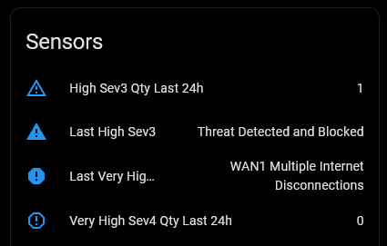

</details>

<details><summary>
&nbsp; &nbsp; ➕ &nbsp; &nbsp; Gateway Screenshot:
</summary><br>


</details>

<details><summary>
&nbsp; &nbsp; ➕ &nbsp; &nbsp; Internet Screenshots:
</summary><br>

| Internet Data Use | Internet Diagnostic Info |
| :-: | :-: |
|  |  |

</details>

<details><summary>
&nbsp; &nbsp; ➕ &nbsp; &nbsp; Security Screenshots:
</summary><br>

| Security Sensors | Security Configuration | Security Diagnostic Info |
| :-: | :-: | :-: |
| 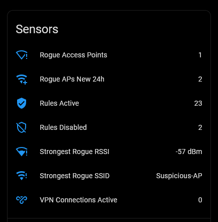 | 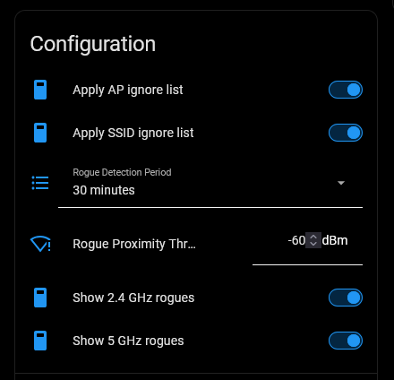 | 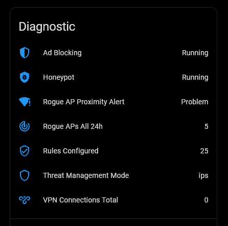 |

</details>

<details><summary>
&nbsp; &nbsp; ➕ &nbsp; &nbsp; Speedtest Screenshots:
</summary><br>

| Speedtest Controls + Sensors | Speedtest Diagnostic Info |
| :-: | :-: |
| 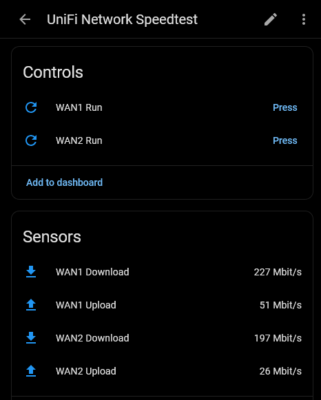 | 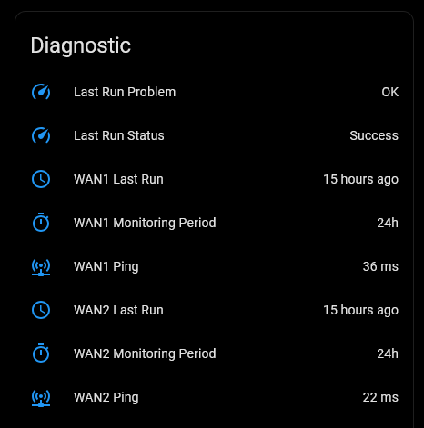 |

</details>

<details><summary>
&nbsp; &nbsp; ➕ &nbsp; &nbsp; Status Screenshot:
</summary><br>

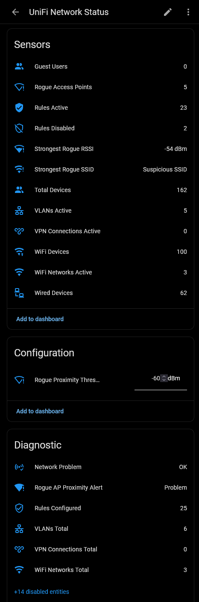

</details>

<details><summary>
&nbsp; &nbsp; ➕ &nbsp; &nbsp; System Screenshot:
</summary><br>


</details>

---

<br>

> [!TIP]
>
> **Not sure what a sensor does?** Many entities carry a short built-in **About** note. Click the sensor to open it, use the **⋮ (three-dots) menu → Details**, and look for the **`about`** attribute - a one-line explanation of that sensor.
>
> 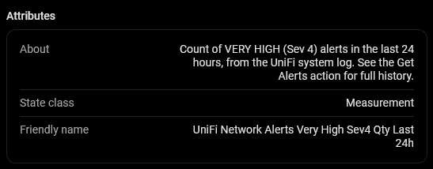
>
> These **About** notes - and a few intentionally large attributes, such as the rogue-AP list on **Strongest Rogue SSID** - are set **unrecorded**. Home Assistant still shows them live in the entity's details, but **never writes them to the history/recorder database**. That keeps bulky or purely-informational values from bloating your database, with no downside to what you see day-to-day.

---

> [!NOTE]
>
> **Per-device sensors scale with your hardware.** Choosing **Add all device sensors** creates one sub-device per adopted AP/switch: **+11 entities per AP** and **+6 per switch**. For example, a set-up with 4 APs + 4 switches adds **68 entities**.
>
> **Enabled-by-default depends on HA Core UniFi:** if you do **not** run the official HA Core UniFi integration, all of these per-device entities are created **and enabled**. If you **do** run Core UniFi, only the AP **Satisfaction Score** is enabled by default and the rest come in disabled (they'd duplicate what Core already provides - hence the "duplicates disabled" label). Remember, this is what happens when you choose **Add all device sensors**.

---

### 📊 Coexistence Summary: With vs. Without HA Core UniFi

Below is a quick reference showing how entities are default-enabled depending on whether you run the official Home Assistant **UniFi Network** integration alongside this one. For the entity **counts**, see the [What You Get](#-what-you-get) table above - this table covers only the default enabled/disabled behavior.

| Scenario / Entity Group | Without Core UniFi (Standalone) | With Core UniFi Installed (Coexistence) | Rationale / Detail |
| :-- | :-- | :-- | :-- |
| **Base Install Entities** | All created; infrastructure diagnostics **enabled** | All created; six gateway diagnostics **disabled** | Standalone mode enables all infrastructure diagnostics by default. |
| **Gateway Diagnostics** _(CPU, Memory etc.)_ | **Enabled** by default | **Disabled** by default | Avoids duplicate diagnostic telemetry since Core UniFi already monitors the gateway hardware. |
| **Per-Device Entities** _(AP & Switch Client/CPU/Uptime)_ | **Opt-in** _(Created as **Enabled** if added)_ | **Opt-in** _(Created as **Disabled** if added)_ | These entities are not created by default. If you choose to add them, they are created as Enabled in Standalone mode, but Disabled in Coexistence mode to avoid duplicates. |

> [!TIP]
>
> **Duplicate-of-core entities:** the per-device Clients / CPU / Memory / Uptime sensors keep their display name but get a `_mon` suffix on their entity ID (e.g. `sensor.<device>_clients_mon`), so when the official UniFi integration is also present you can tell Monitor's copy apart from Core's - on both APs and switches. Per-device entity IDs are prefixed with the **device name**, not `unifi_network_`.

---

</details>

<br>

## 🧩 Tailoring What's Monitored

**Installed with its defaults, this integration needs no adjustment** - everything works out of the box. But it exposes a lot, and you may not want all of it. You have options.

<details>

<summary>
&nbsp; &nbsp; ➕ &nbsp; &nbsp; Click to Expand for Details:
</summary><br>

Typical cases:

- Running a **single WAN** (or failover only)? You may not care about the **WAN2** sensors.
- Not interested in the gateway's **speedtests**? You may not need the **Speedtest** sub-device.
- Not monitoring **rogue APs / threats**? You may have no use for the **Security** sub-device.
- Don't need **system-log alerts**? Skip the **Alerts** sub-device. …and so on.

### 1. Do nothing (the easy option)

If you're simply not interested in some sensors, **you don't need to do anything - just ignore them.** The overhead is minimal (a disabled entity costs nothing; even an enabled one is just a row on a card). If in doubt, leave everything as-is.

### 2. Disable sensors or sub-devices (standard Home Assistant)

Use Home Assistant's built-in visibility controls - nothing specific to this integration:

- **One sensor:** click the entity → **⚙️ (settings)** → turn **Enabled** off.
- **A whole sub-device:** open its device page (e.g. _UniFi Network Speedtest_) → **⋮ menu → Disable device** - this disables every entity on that card at once.

Disabled entities stay in the registry (greyed out) and can be re-enabled any time. This hides them from your UI; the integration still polls as normal.

### 3. Turn off whole feature groups (also stops polling)

Open **Settings → Devices & Services → UniFi Network Monitor → Configure** (⚙️ gear). Here you can enable/disable whole **feature groups**. Unlike option 2, turning a group off both **removes its sensors _and_ skips its API calls**. All default to **on**:

| Feature group | What it removes |
| :-- | :-- |
| **Alerts monitoring** | The **Alerts** sub-device (system-log High/Very High) |
| **Dual-WAN monitoring** | The **WAN2** + load-balance entities (turn off for single-WAN) |
| **Security monitoring** | The **Security** sub-device (rogue APs, VPN, firewall, threat management) |
| **Speedtest monitoring** | The **Speedtest** sub-device + run buttons |
| **WAN data-usage statistics** | The daily/monthly data-usage sensors |

The same screen also sets the **UniFi device (AP & Switch) sensors** scope (none / satisfaction-only / all). Full detail in [Configuration](#-configuration).

> [!IMPORTANT]
>
> Turning a group off with _Configure_ **stops creating** its sensors, but Home Assistant never auto-deletes - the old entities linger as `unavailable` orphans. Remove them with the **Clean Up Unused Entities** button or the `unifi_network_monitor.cleanup_unused_entities` action → see [Actions](#-actions-services).

---

</details>

<br>

### 📊 Long Term Statistics (LTS)

Home Assistant records Long Term Statistics for a numeric sensor **only when it declares a `state_class`**. Sensors without one still show a live value and short-term history, but are not rolled up into LTS (no hourly min/mean/max, and they can't be used in the Statistics graph). Text, IP, version, mode and timestamp sensors are never LTS candidates.

**Most numeric sensors here are in LTS** - CPU/memory/temperatures, signal/RSSI, latency, the **active/primary** counts (devices, user & guest clients, active VLANs/VPNs/WiFi networks, active & disabled firewall rules, rogue APs), Storage Utilization (%), WAN1 Load-Balance weight, **daily _and_ monthly** data usage, and speedtest **download / upload / ping**.

<details>

<summary>
&nbsp; &nbsp; ➕ &nbsp; &nbsp; Click to Expand for Details:
</summary><br>

A deliberately-curated set is **left out of LTS** (no `state_class`) - either it's redundant with a sibling that _is_ tracked, or it's a near-static/derivable value not worth a trend series. The excluded numeric sensors are:

| Group | Sensors (not in LTS) | Why |
| :-- | :-- | :-- |
| **Raw storage bytes** | Storage Used, Storage Total | the **Storage Utilization (%)** sibling is in LTS |
| **WAN availability & durations** | WAN1/2 Availability (%), WAN1/2 & Internet Uptime (s), WAN1/2 Time Period (s) | duration counters; a `boot_time` timestamp already marks "since when" |
| **Redundant / total siblings** | WAN2 Load Balance (sums to 100 with WAN1), Firewall Rules Configured, WiFi Networks Total, VLANs Total/Configured, VPN Connections Total | the **changeable** sibling (Active/Disabled/WAN1) is the one tracked |
| **Secondary client/device counts** | WiFi IoT Clients, WiFi AP count, LAN IoT Clients, LAN Switch count, Adopted Devices | the **primary** user/guest client counts are tracked |

(Text, IP, version, mode and timestamp sensors are never LTS candidates and aren't counted here. There are **no** excluded per-AP/switch sensors - the AP Satisfaction Scores _are_ in LTS.)

> [!TIP]
>
> **Want to force a sensor into Long Term Statistics anyway?**
>
> Add a `state_class` override via [Manual Customization](https://www.home-assistant.io/integrations/homeassistant/#manual-customization) in your `configuration.yaml`. For example, to track WAN2 Load Balance in LTS:
>
> ```yaml
> homeassistant:
>   customize:
>     sensor.unifi_network_system_wan2_load_balance:
>       state_class: measurement
> ```
>
> Restart Home Assistant after saving. The sensor will begin accumulating LTS from that point forward.
>
> The inverse is also true, setting `state_class: none` will remove a sensor from LTS. This is a legitimate tactic, if you want to see a sensors value for this week (default retention), but not for this year.
>
> If you want to see the current value, but have no interest in short or long term history, you can [exclude a value from the Recorder](https://www.home-assistant.io/integrations/recorder/#configure-filter).
>
> And of course, if a particular sensor, or group of sensors is of no interest to you, you can very easily disable it. See [Tailoring What's Monitored](#-tailoring-whats-monitored) above. Remember you don't **need** to do **any** of this. These are _extra_ options for the Home Assistant user who wants _extra_ control.

---

</details>

<br>

## 📸 Screenshots

Screenshots are embedded throughout the document near relevant sections. This is the Integration Overview screen, highlighting the division into seven sub-devices.

### Integration Overview


---

## 📡 Rogue Access Point Monitoring

UniFi access points continuously scan for nearby Wi-Fi networks. Any SSID broadcasting nearby that is not part of your managed UniFi network is reported by the controller as a "**Rogue Access Point**".

This integration surfaces those detections through the **Security** sub-device. By default it shows the unique Rogue APs seen in the last hour, but you control the look-back window and the filtering (see **Tuning**, below).

<details>
  
<summary>
&nbsp; &nbsp; ➕ &nbsp; &nbsp; Click to Expand for Details:
</summary><br>

**Sensors & alert:**

- **Rogue Access Points (`sensor.*_rogue_access_points`)**: Count of unique rogue APs, after your band and ignore-list filtering.
- **Strongest Rogue SSID (`sensor.*_strongest_rogue_ssid`)**: The SSID of the rogue network with the strongest (least-negative) signal.
  - _Attributes_: a `rogue_aps` list (the strongest, up to 25 listed) with each rogue's SSID, BSSID (MAC), band, channel, channel width, signal (RSSI), security, vendor (OUI), age, last-seen, `wired_rogue`, `is_adhoc`, `ssid_anomaly`, and the friendly name of the UniFi AP that detected it. A hidden SSID is named from its BSSID as `Hidden-A2D3` (last 4 hex) so distinct cloaked APs stay distinguishable. `rogue_aps_truncated` flags if the list was capped - use the `get_rogue_aps` action for the complete set.
- **Strongest Rogue RSSI (`sensor.*_strongest_rogue_rssi`)**: The signal strength (in dBm) of the strongest rogue network.
- **Rogue APs All 24h (`sensor.*_rogue_aps_all_24h`)**: The **raw, unfiltered** total detection count over a rolling 24 hours - every detection by every UniFi AP, ignoring all your settings and lists. A gauge of background rogue "noise", distinct from the filtered count above.
- **Rogue APs New 24h (`sensor.*_rogue_aps_new_24h`)**: Count of Rogue (B)SSIDs identified as **new** over a rolling 24 hours - every **NEW** detection by every UniFi AP, ignoring all your settings and lists.
- **Rogue AP Proximity Alert (`binary_sensor.*_rogue_ap_proximity_alert`)**: A `PROBLEM` binary sensor that turns `on` when the strongest rogue's RSSI is at or above your **Rogue Proximity Threshold** (e.g. `-50` dBm is higher/stronger than `-60` dBm). See the [Rogue AP Proximity Alert](#-rogue-ap-proximity-alert) example.

**Tuning (Security sub-device controls):**

- **Rogue Detection Period** - how far back to look (30 min … 1 month).
- **Show 2.4 GHz / 5 GHz Rogues** - include or drop each band.
- **Apply SSID / AP Ignore List** - hide known-friendly networks/APs (lists set in Configure; SSID matching applies by default, AP matching is opt-in).
- **Rogue Proximity Threshold** - the "nearby" cut-off in dBm (default `-60`).

Three further rogue settings are set in **Configure** rather than as entities - the **SSID** and **AP ignore lists** (the content the two switches above apply), and **rogue history retention**. See [Runtime Options](#-runtime-options-configure--reconfigure) for their defaults and formats.

**On-demand & automations:**

- **`get_rogue_aps` action** - query the current rogue set on demand with your own band / signal / keyword / exclude filters (see [Actions](#-actions-services)). Worked examples: [Daily Rogue AP Digest](#-daily-rogue-ap-digest) and [New / Reset Smart-Home Device Nearby](#-new--reset-smart-home-device-nearby).
- **`unifi_network_monitor_new_rogue_ap` event** - fires when a new rogue BSSID first appears, for triggering automations (see [Events](#-events)).

### 🕒 Rogue AP appearance history

For each rogue **BSSID**, the integration keeps a small persisted record - `first_seen` (when HA first tracked it), `appearances` (poll cycles seen), pruned by the **Rogue history retention** option (see [Runtime Options](#-runtime-options-configure--reconfigure)). It powers:

- **`first_seen` / `appearances`** on the `get_rogue_aps` response and the `new_rogue_ap` event. The [Daily Rogue AP Digest](#-daily-rogue-ap-digest) example uses them to separate new arrivals from long-standing neighbors.
- The **Rogue APs New 24h** sensor - a count of (B)SSIDs first seen in the last 24 h (LTS-enabled for trends).
- A `new_rogue_ap` event that fires only for **genuinely-new** (B)SSIDs and **survives restarts** (no re-fire for already-known APs after a reload).

**Caveats:** `first_seen` is "first seen by _Home Assistant_", not by the gateway - on first enable everything counts as new for 24 h. And BSSID-randomizing devices (some phones/IoT) appear new on each rotation. Use `clear_rogue_history` to reset.

### ❓ Why is this useful?

- **Security Awareness**: Detect if someone has plugged in an unauthorized router nearby, or is running an "evil twin" AP mimicking common SSIDs.
  - while ignoring known SSIDs - like your neighbors' WiFi
- **Smart Home Troubleshooting**: Since smart home devices occasionally fail and revert to their own internal Wi-Fi broadcast setup (e.g. a Shelly plug broadcasting `shellyplug-s-XXXXXX` when disconnected), this alert can notify you immediately if a smart plug or IoT device has dropped offline and is broadcasting its setup SSID. → [New / Reset Smart-Home Device Nearby](#-new--reset-smart-home-device-nearby) example.

### 📘 How to use it

1. Look at the typical signal levels of your neighbors' Wi-Fi networks in your dashboard. _(Note: You should add their SSIDs to your ignore list but before you do, this is a great way to get a sense of what signal levels "nearby" WiFi has in your set-up)_
2. Set your **Rogue Proximity Threshold** slightly above this normal background level (e.g. if neighbors average `-75` dBm, set the threshold to `-65` or `-60` dBm).
3. Optionally narrow the noise: set the **Rogue Detection Period**, add known-friendly SSIDs/APs to the ignore lists, or turn off a band you don't care about.
4. Set up an automation to notify you when the **Proximity Alert** turns `on` - see the [Rogue AP Proximity Alert](#-rogue-ap-proximity-alert) example, or trigger on the `unifi_network_monitor_new_rogue_ap` event instead.

---

</details>

<br>

## 🔘 Controls & Settings

Several settings are exposed as control entities so you can drive them from dashboards or automations:

- **Clean Up Unused Entities** (`button`, System) - remove orphaned entities (see [Actions](#-actions-services)).
- **Pause Polling** (`switch`, System) - halt scheduled polling temporarily. Manual actions (below) still fetch while paused. See the [Auto-Resume Polling](#-auto-resume-polling) example.
- **Polling Interval** (`number`, System) - scan interval in seconds (default `180` seconds, range `10` to `3600`). The [Guest Network in Use](#-guest-network-in-use) example reads it to size its own `for:` duration.
- **Refresh Now** (`button`, System) - immediate data fetch (works even while Pause Polling is on). Used by the [WAN Failover / Restore](#-wan-failover--restore-dual-wan) and [Internet / WAN Down Alert](#-internet--wan-down-alert) examples to confirm a state change.
- **WAN1 Load Balance Weight** (`number`, System) - WAN1 share of a weighted dual-WAN setup; WAN2 gets set to `100 − WAN1`. See the [Optimize WAN Weight on High Latency](#-optimize-wan-weight-on-high-latency) example.

- **Apply AP SSID Ignore List** (`switch`, Security) - apply the ignore lists you set in Configure (AP opt-in).
- **Apply SSID Ignore List** (`switch`, Security) - apply the ignore lists you set in Configure (SSID applied by default).
- **Rogue Detection Period** (`select`, Security) - how far back the rogue poll looks (30 min … 1 month). Shown only when Security monitoring is on.
- **Rogue Proximity Threshold** (`number`, Security) - dBm at or above which a rogue AP triggers the Proximity Alert (default `-60`; always negative, closer to zero is stronger). See the [Rogue AP Proximity Alert](#-rogue-ap-proximity-alert) example.
- **Show 2.4 GHz Rogues** (`switch`, Security) - include or drop the 2.4 GHz band from the rogue sensors.
- **Show 5 GHz Rogues** (`switch`, Security) - include or drop the 5 GHz band from the rogue sensors.

All of these control changes apply **immediately** - even while Pause Polling is on, an explicit change triggers a fresh fetch.

<details><summary>
&nbsp; &nbsp; ➕ &nbsp; &nbsp; Clink to Expand Controls Screenshots:
</summary><br>

| Security Controls | System Controls |
| :-: | :-: |
|  | 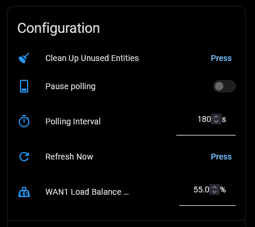 |

---

</details>
<br>

## 🧹 Actions (Services)

The integration provides seven (7) actions (services) that provide additional detail, insight and capabilities, especially for enabling automation.

- `cleanup_unused_entities`: Removes entities the current options no longer provide.

- `get_alerts`:Returns recent UniFi **system-log alerts** on demand. → [Scheduled Alert Digest](#-scheduled-alert-digest) example.

- `get_rogue_aps`: Returns the current **rogue-AP set** on demand. → [Daily Rogue AP Digest](#-daily-rogue-ap-digest) and [New / Reset Smart-Home Device Nearby](#-new--reset-smart-home-device-nearby) examples.

- `clear_rogue_history`: Erases the persistent rogue-AP appearance history.

- `add_rogue_ignore` / `remove_rogue_ignore` / `set_rogue_ignore`: Manage the two rogue **ignore lists** from automations.

The integration also fires two bus **events** for automations - see [Events](#-events) below the action detail.

<details>

<summary>
&nbsp; &nbsp; ➕ &nbsp; &nbsp; Click to Expand for Details:
</summary><br>

---

### `unifi_network_monitor.cleanup_unused_entities`

Removes entities the current options no longer provide - per-device sensors excluded by the device mode, and gateway sensors for any feature toggled off - and detaches any device left with no Monitor entities. The **Clean Up Unused Entities** button is the one-click equivalent (commit only); this action adds a preview via `dry_run`.

| Parameter | Required | Default | Description |
| :-- | :-- | :-- | :-- |
| `dry_run` | No | `true` | When `true`, only reports what would be removed (nothing is changed). Set `false` to actually remove. |

The action supports **Action Responses**, returning the entities/devices it removed (or would remove) - visible in **Developer Tools → Actions**.

```yaml
# Preview what would be removed (safe - changes nothing)
action: unifi_network_monitor.cleanup_unused_entities
data:
  dry_run: true
response_variable: cleanup_report
```

```yaml
# Actually remove the orphaned entities
action: unifi_network_monitor.cleanup_unused_entities
data:
  dry_run: false
```

> Cleanup only ever touches Monitor's own devices and entities. The official UniFi integration has its own separate device cards, which are never affected.


---

### `unifi_network_monitor.get_alerts`

Returns recent UniFi **system-log alerts** on demand - the history the passive Alerts sensors can't hold. Fetches fresh data, so it works even if the Alerts group is off. Supports **Action Responses** (returns `{count, alerts: [...]}`; with `count_total: true`, also `total_matched` and `truncated`). The [Scheduled Alert Digest](#-scheduled-alert-digest) example turns this response into a daily summary.

| Parameter | Required | Default | Description |
| :-- | :-- | :-- | :-- |
| `device_id` | No | sole entry | Which gateway to query (only needed with more than one configured - see the note below). |
| `severity` | No | High + Very High | Any of Low / Medium / High / Very High. **YAML values:** `LOW`, `MEDIUM`, `HIGH`, `VERY_HIGH`. Low/Medium can be very high-volume. |
| `quantity` | No | `10` | Max alerts to return (1–100). |
| `age_days` | No | - | Only alerts newer than this many days. |
| `keyword` | No | - | Comma-separated terms; keep any alert whose title/message contains **at least one** (case-insensitive substring, include). |
| `exclude` | No | - | Comma-separated terms; drop any alert whose title/message contains one of them. Applied **after** `keyword`. |
| `count_total` | No | `false` | Also return `total_matched` (how many matched, scanning past `quantity` up to the 500-record cap) and `truncated: true` if that cap was hit before the log/age was exhausted. Off by default to keep the query light. |

```yaml
action: unifi_network_monitor.get_alerts
data:
  severity: [HIGH, VERY_HIGH]
  quantity: 20
response_variable: alerts
```

> **`count_total`:** without it you get `count` (≤ `quantity`) only. With `count_total: true` the response adds `total_matched` - the real number of matches - and `truncated`, which is `true` when there are more matches than the 500-record scan could reach (so `total_matched` is a floor, not the absolute total).

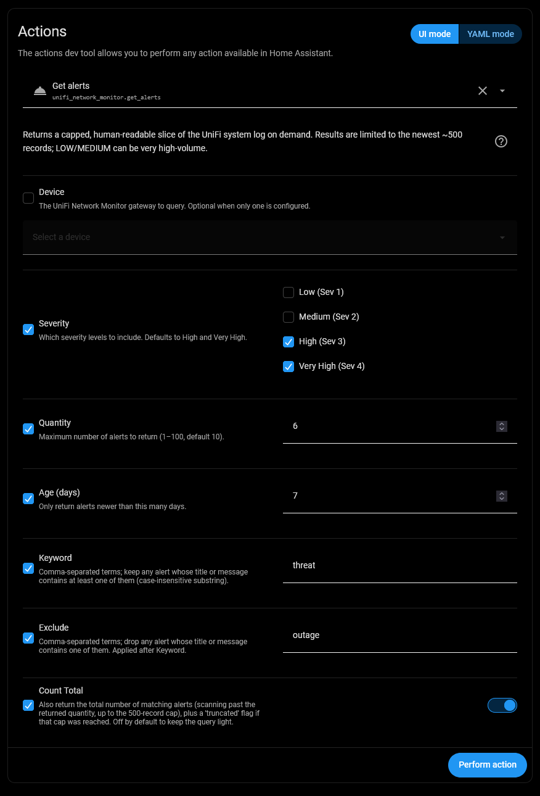

---

### `unifi_network_monitor.get_rogue_aps`

Returns the current **rogue-AP set** on demand (fresh fetch, works even if Security monitoring is off). Applies only the filters you pass - not the sensor's ignore lists - so you can surface an AP you've hidden from the passive view. Supports **Action Responses** (returns `{count, total_matched, rogue_aps: [...]}`). Worked examples: [Daily Rogue AP Digest](#-daily-rogue-ap-digest) (scheduled summary) and [New / Reset Smart-Home Device Nearby](#-new--reset-smart-home-device-nearby) (keyword-filtered).

| Parameter | Required | Default | Description |
| :-- | :-- | :-- | :-- |
| `device_id` | No | sole entry | Which gateway to query (see the note below). |
| `period` | No | `24h` | How far back to look. **YAML values:** `30m`, `1h`, `6h`, `24h`, `7d`, `30d`, `90d`, `all`. |
| `band` | No | `both` | Which band(s). **YAML values:** `2.4`, `5`, `both`. |
| `min_signal` | No | - | Only APs at or above this signal (dBm, e.g. `-70`). |
| `quantity` | No | `10` | Max rogue APs to return, strongest first (1–100). |
| `keyword` | No | - | Comma-separated terms; keep any rogue AP whose SSID, vendor (OUI), or security contains **at least one** (case-insensitive substring, include). |
| `exclude` | No | - | Comma-separated terms; drop any rogue AP whose SSID, OUI, or security contains one of them. Applied **after** `keyword`. |

> **`total_matched`** is always returned here - it's the full count of APs matching your filters, while `count`/`rogue_aps` are capped at `quantity`. Trigger on `rogues.total_matched > N` to count without pulling the whole list.

```yaml
action: unifi_network_monitor.get_rogue_aps
data:
  band: both
  min_signal: -70
  exclude: "eero, apple" # skip these vendors
response_variable: rogues
```

Each returned rogue AP carries: `essid`, `ssid_anomaly`, `bssid`, `band`, `channel`, `channel_width` (MHz), `signal` (dBm), `security`, `oui` (vendor), `wired_rogue`, `is_adhoc`, `age`, `last_seen`, `first_seen`, `appearances`, and `detected_by`.

- **`first_seen` / `appearances`** - from the persistent appearance history: when Home Assistant _first tracked_ this BSSID and how many poll cycles it's appeared in. Lets you tell a **brand-new** rogue (`first_seen` minutes ago, `appearances: 1`) from a **long-standing** neighbor. See [Rogue AP appearance history](#-rogue-ap-appearance-history), and the [Daily Rogue AP Digest](#-daily-rogue-ap-digest) example for both fields in use.

- **`wired_rogue`** - `true` only when UniFi has confirmed the AP is **physically bridged to your LAN** (an unauthorized device plugged into your network), not merely a neighbor's Wi-Fi. This is the genuine "rogue" in UniFi's sense and the one worth alerting on; most detections are `false`.
- **`ssid_anomaly`** - `true` when the SSID was **hidden** (broadcast blank → named `Hidden-A2D3` from the BSSID) **or** contained control / zero-width / right-to-left characters (replaced with `·`). A common Wi-Fi impersonation trick is an SSID that _looks_ like yours but hides tampering in non-printable characters - this flag surfaces it.

  > **Hidden-SSID naming & MAC randomization:** a cloaked AP is named `Hidden-` + the last 4 hex of its BSSID (extended to 6 if two collide), so the _same_ AP keeps the _same_ name across polls - you can tell a returning neighbor from a brand-new one. **Caveat:** phones and some devices randomize their BSSID; such a source appears as a _new_ `Hidden-XXXX` on each rotation, so it will look new even when it isn't. Infrastructure APs and most reset smart-home devices keep a stable BSSID.

> **ℹ️ Which device do I pick?** In the usual single-gateway setup, leave `device_id` blank - it defaults to your only gateway. If you tick **Device** in the UI you'll see all seven sub-devices (Gateway, Security, Alerts, …); that's expected - they all belong to the same gateway, so **any one resolves to the same result**. `device_id` only _matters_ if you run **more than one UniFi gateway**, where it disambiguates which one to query.

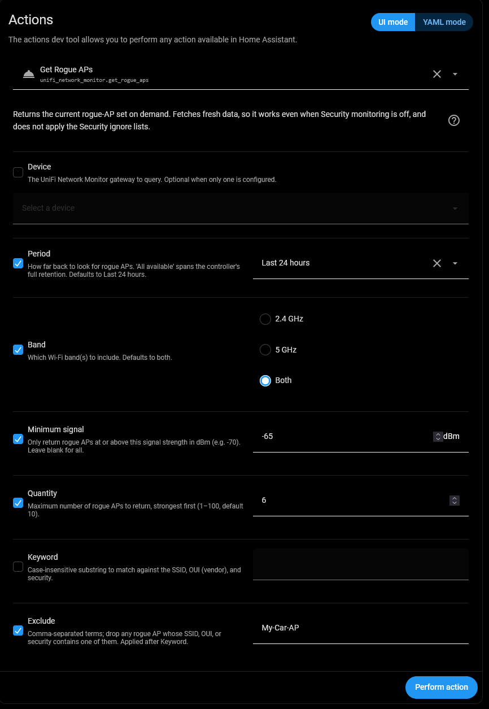

---

### `unifi_network_monitor.clear_rogue_history`

Erases the persistent rogue-AP appearance history (`first_seen` / `appearances`). History rebuilds from the next poll. Optional `device_id`.

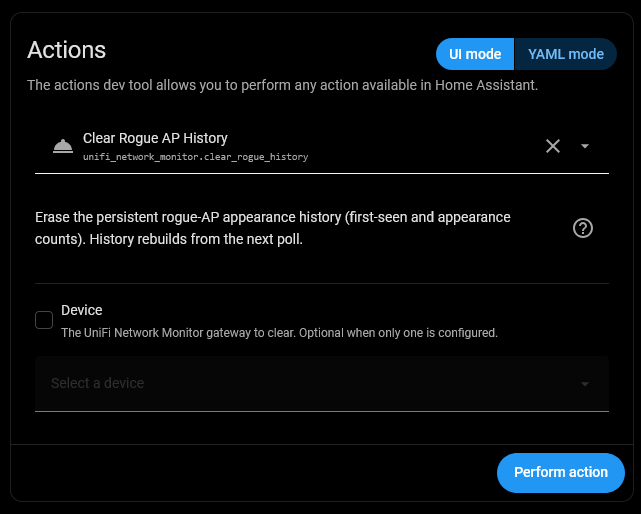

### `unifi_network_monitor.add_rogue_ignore` / `remove_rogue_ignore` / `set_rogue_ignore`

Manage the two rogue **ignore lists** from automations - **Ignore Rogue SSIDs** and **Ignore detecting APs** - which otherwise are only editable via **Configure**. Pick the list with `target: ssids | aps`.

| Action | Params | Returns |
| :-- | :-- | :-- |
| `add_rogue_ignore` | `target`, `value` (pattern; wildcards OK, e.g. `Hidden-*`) | `{target, entries}` (resulting list) |
| `remove_rogue_ignore` | `target`, `value` (exact match; silent if absent) | `{target, entries}` |
| `set_rogue_ignore` | `target`, `values` (comma-separated; blank clears) | `{target, old, new}` (previous + applied, for undo) |

```yaml
# Whitelist a guest SSID pattern when the guest switch turns on
action: unifi_network_monitor.add_rogue_ignore
data:
  target: ssids
  value: "MyGuest_*"
```

> These affect the **passive Security view** (the rogue sensors), not the `get_rogue_aps` action, which deliberately ignores the ignore-lists. Changing a list applies immediately (it reloads the entry) - call them on a state change, not in a tight loop.

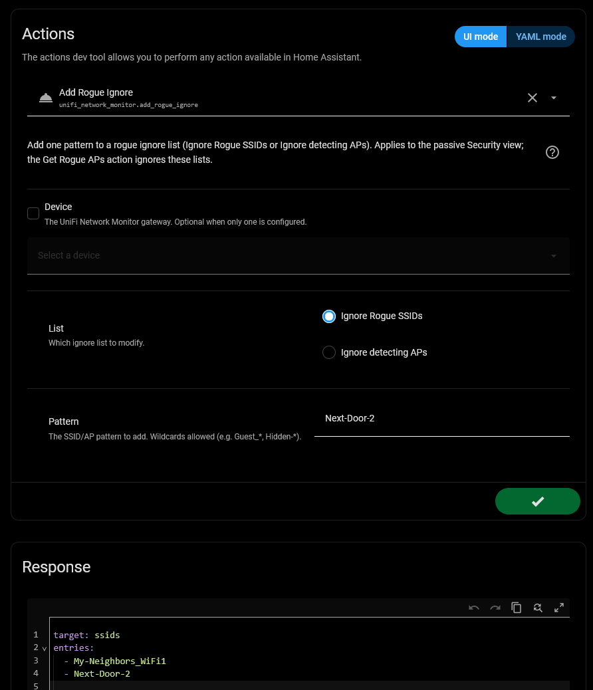

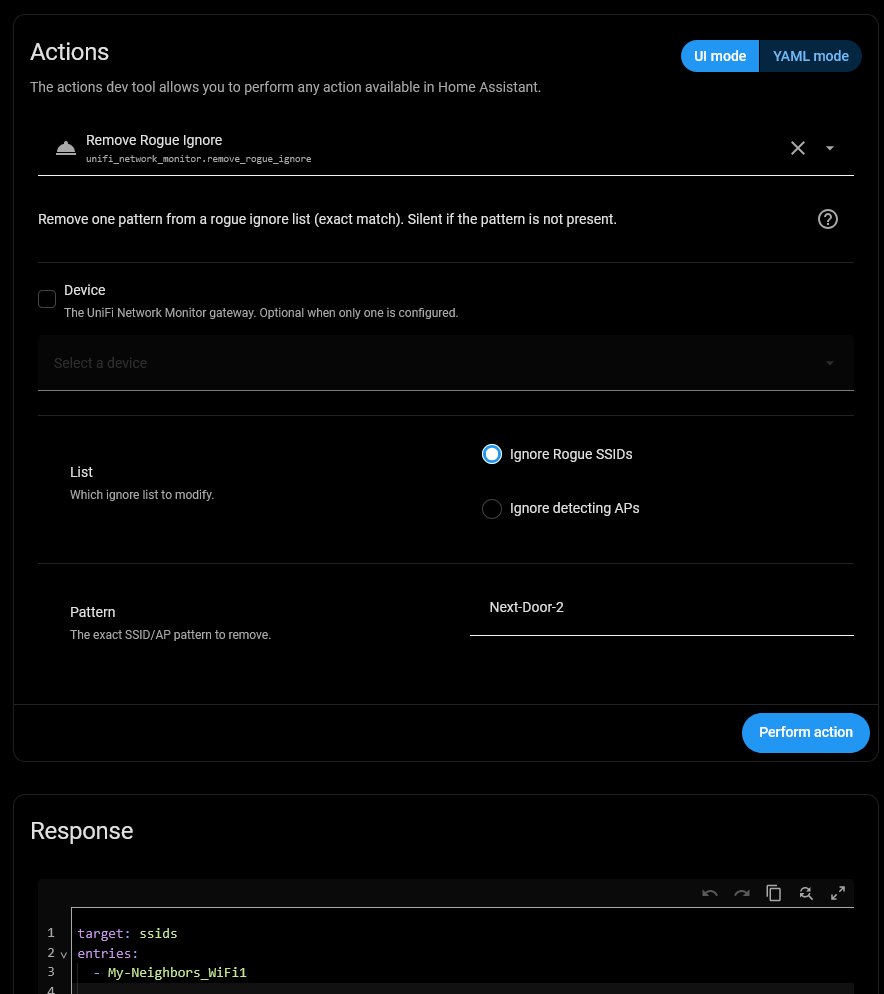

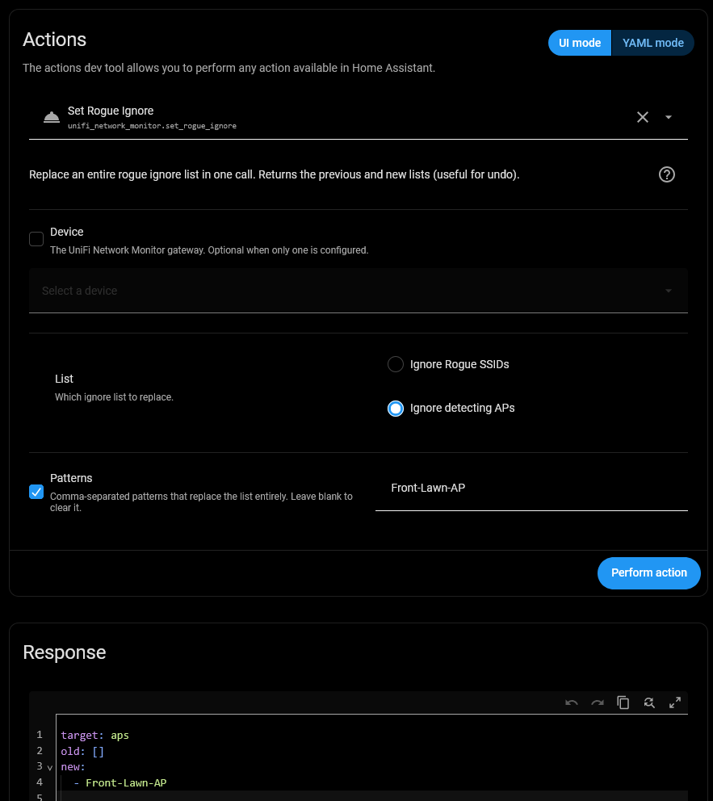

---

</details>

<br>

### 📨 Events

Alongside the actions, the integration fires two bus events you can use as automation triggers. Both fire **once** per newly-seen item, record the existing backlog silently on startup or re-enable (no replay), and only fire while their owning sensor group is enabled.

| Event type | Fires when | `trigger.event.data` fields |
| :-- | :-- | :-- |
| `unifi_network_monitor_new_alert` | A previously-unseen **High / Very High** system-log alert appears (requires **Alerts monitoring** on) | `title`, `message`, `severity` (`HIGH` / `VERY_HIGH`), `category`, `event`, `id`, `timestamp`, `status` |
| `unifi_network_monitor_new_rogue_ap` | A rogue **BSSID** is seen for the first time (requires **Security monitoring** on) | `essid`, `bssid`, `band`, `channel`, `signal`, `security`, `oui`, `wired_rogue`, `is_adhoc`, `ssid_anomaly`, `first_seen`, `appearances`, `detected_by` |

See the [Critical UniFi Alert](#-critical-unifi-alert-sev4) automation for a worked example using `unifi_network_monitor_new_alert`.

## 💡 Example Automations

> [!NOTE]
>
> Entity IDs are derived from your gateway/sub-device names (e.g. `sensor.unifi_network_status_...`) and **may differ between installs**, or if you have renamed entities or devices. Use the entity picker in the Automation editor rather than copying the IDs below verbatim. The examples are illustrative.

---

> [!NOTE]
>
> The Automation examples below use the `note:` functionality introduced in Home Assistant 2026.6 as a way to document/comment Automations that is permanent and **not** stripped out by the editor. If using an older version of Home Assistant you may need to remove the `note:` sections

---

> [!NOTE]
>
> Use your own preferred Automation notifier

<details>

<summary>&nbsp; &nbsp; &nbsp; &nbsp; ➕ &nbsp; Click to Expand for Notification Options:
</summary><br>

Replace

```yaml
action: persistent_notification.create
```

with

```yaml
action: notify.send_message
target:
  entity_id: notify.your_specific_phone
```

---

</details>

### 🔒 Security Related Automations

Monitor for Rogue Access Points, critical system-log alerts, and Guest WiFi use

#### 📶 Rogue AP Proximity Alert

<details>

<summary> &nbsp; &nbsp; Notify when an unknown access point is detected nearby (signal at/above your threshold)<br>
&nbsp; &nbsp; &nbsp; &nbsp; ➕ &nbsp; Click to Expand for Automation Detail:
</summary><br>

```yaml
alias: "UniFi: Rogue AP Nearby"
description: |
  Notifies when an unknown access point is detected nearby, waiting for consecutive
  polls to filter out transient signals.
triggers:
  - trigger: state
    entity_id: binary_sensor.unifi_network_security_rogue_ap_proximity_alert
    to: "on"
    for:
      seconds: |
        {{ [120, (states('sensor.unifi_network_system_polling_interval') | int(180)) + 5] | max }}
    note: |
      Triggers when a rogue AP exceeds the proximity threshold. Dynamic delay ensures waiting
      for consecutive polls to confirm it is a sustained threat rather than a passing vehicle.
actions:
  - action: persistent_notification.create
    data:
      title: "Rogue AP detected nearby"
      message: |
        Strongest Rogue AP: {{ states('sensor.unifi_network_security_strongest_rogue_ssid') }}
        at {{ states('sensor.unifi_network_security_strongest_rogue_rssi') }} dBm.
    note: |
      Sends a notification containing the SSID and RSSI signal level of the strongest rogue AP.
```

---

</details>

#### 🚨 Critical UniFi Alert (Sev4)

<details>

<summary> &nbsp; &nbsp; Notify on each new <b>Very High (Sev4)</b> UniFi system-log alert, using the <code>new_alert</code> event.<br>
&nbsp; &nbsp; &nbsp; &nbsp; ➕ &nbsp; Click to Expand for Automation Detail:
</summary><br>

```yaml
alias: "UniFi: Critical Alert (Sev4)"
description: |
  Sends a notification for each new Very High (Sev4) UniFi system-log alert.
  Broaden the event_data severity filter (or remove it) to also catch High (Sev3).
triggers:
  - trigger: event
    event_type: unifi_network_monitor_new_alert
    event_data:
      severity: VERY_HIGH
    note: |
      Fires once per newly-seen Very High alert. The integration only fires this event while
      Alerts monitoring is enabled
actions:
  - action: persistent_notification.create
    data:
      title: "UniFi alert: {{ trigger.event.data.title }}"
      message: "{{ trigger.event.data.message }}"
    note: |
      Sends the alert title and message. Other fields on trigger.event.data include
      severity, category, event, id, timestamp, and status.
```

---

</details>

#### 📋 Scheduled Alert Digest

<details>

<summary> &nbsp; &nbsp; Receive an Alert Summary each morning.<br>
&nbsp; &nbsp; &nbsp; &nbsp; ➕ &nbsp; Click to Expand for Automation Detail:
</summary><br>

If you prefer one summary a day over a notification per alert, this calls the **`get_alerts`** action on a schedule and formats the returned list into a single message, turning the action's JSON response into a readable notification.

```yaml
alias: "UniFi: Daily Alert Digest"
description: |
  Once a day, fetches recent High/Very High alerts and sends them as one summary
  notification (only if there are any).
triggers:
  - trigger: time
    at: "08:00:00"
    note: Morning digest - adjust the time to suit.
actions:
  - action: unifi_network_monitor.get_alerts
    data:
      severity: [HIGH, VERY_HIGH]
      quantity: 10
      age_days: 1
    response_variable: alerts
    note: |
      Fetches up to 10 High/Very High alerts from the last day. The result lands in the
      alerts variable as {count, alerts: [{title, severity, message, timestamp, ...}]}.
  - condition: template
    value_template: "{{ alerts.count > 0 }}"
    note: Stop here (no notification) when there were no alerts.
  - action: persistent_notification.create
    data:
      title: "UniFi: {{ alerts.count }} alert(s) in the last 24h"
      message: |
        • {{ alerts.alerts | map(attribute='title') | join('\n• ') }}
    note: |
      One bulleted line per alert title. To include severity, swap the message for a loop:
      • {{ a.severity }} - {{ a.title }}
      
```

---

</details>

#### 📡 Daily Rogue AP Digest

<details>

<summary> &nbsp; &nbsp; Each morning, send the <b>top 3 strongest rogue APs</b> seen in the last 24 hours. The <code>get_rogue_aps</code> action already returns results strongest-first, so `quantity: 3` gives the top three.<br>
&nbsp; &nbsp; &nbsp; &nbsp; ➕ &nbsp; Click to Expand for Automation Detail:
</summary><br>

```yaml
alias: "UniFi: Daily Rogue AP Digest"
description: |
  Each morning, fetches the strongest rogue APs seen in the last 24 hours and sends
  the top 3 as a single notification (only if any were detected).
triggers:
  - trigger: time
    at: "08:30:00"
    note: Morning digest - adjust the time to suit
actions:
  - action: unifi_network_monitor.get_rogue_aps
    data:
      period: "24h"
      band: both
      quantity: 3
    response_variable: rogues
    note: |
      Returns the 3 strongest rogue APs from the last 24h (the action sorts strongest-first),
      as {count, rogue_aps: [{essid, signal, band, bssid, detected_by, ...}]}.
  - condition: template
    value_template: "{{ rogues.count > 0 }}"
    note: Stop here (no notification) when no rogues were detected.
  - action: persistent_notification.create
    data:
      title: "UniFi: top {{ rogues.count }} rogue AP(s) - last 24h"
      message: |-
        
        • {{ r.essid }} - {{ r.signal }} dBm, {{ r.band }}{{ ' ⚠ WIRED ROGUE' if r.wired_rogue else '' }}
        
    note: |
      One bulleted line per rogue: SSID, signal strength, and band. A hidden SSID shows as
      `Hidden-A2D3` (from its BSSID). Each `r` also carries bssid, channel, channel_width,
      security, oui (vendor), age, detected_by, is_adhoc, and wired_rogue (flagged above).
```

---

</details>

#### 🏠 New / Reset Smart-Home Device Nearby

<details>

<summary> &nbsp; &nbsp; Identify <b>factory-reset or newly powered-on</b> WiFi based smart home devices.<br>
&nbsp; &nbsp; &nbsp; &nbsp; ➕ &nbsp; Click to Expand for Automation Detail:
</summary><br>

When **factory-reset or newly powered-on**, many WiFi based smart home devices drop into setup/pairing mode and broadcast their **own Wi-Fi AP** (e.g. `shelly-1A2B3C`, `esp_1234`).

This check runs **every 4 hours between 7 am and 11 pm** and flags any such SSID seen in the last 6 hours - an early heads-up that a device reset itself, dropped off your network, or that a new one appeared.<br>

Rather than the `keyword` field (a single substring), this fetches all recent rogues once and filters them against an **editable vendor list** in the automation - so matching several vendors is one obvious control. Matching is case-insensitive **substring**, so `shelly` matches `shelly-1A2B3C` (no wildcard needed).

```yaml
alias: "UniFi: Smart-Home Device in Setup/AP Mode"
description: |
  Every 4 hours (7am–11pm), checks for nearby Wi-Fi APs broadcast by smart-home
  devices in setup/pairing mode (reset or new), and raises a persistent notification.
triggers:
  - trigger: time
    at:
      - "07:00:00"
      - "11:00:00"
      - "15:00:00"
      - "19:00:00"
      - "23:00:00"
    note: Every 4 hours from 7am to 11pm - add/remove times to change the cadence.
actions:
  - action: unifi_network_monitor.get_rogue_aps
    data:
      period: "6h"
      band: both
      quantity: 50
    response_variable: rogues
    note: |
      Fetches up to 50 rogues from the last 6h (period > the 4h cadence, so nothing is
      missed between runs). quantity is set high so the vendor filter below sees the full
      set rather than only the 10 strongest.
  - variables:
      vendors:
        - shelly
        - sonoff
        - aqara
        - switchbot
        - tuya
        - esp32
      matches: |
               {{ ns.hits }}
    note: |
      `vendors` is the select control - add or remove a prefix to change what's flagged.
      `matches` keeps each rogue whose SSID contains any vendor string (substring, lowercased).
  - condition: template
    value_template: "{{ matches | count > 0 }}"
    note: Stop here (no notification) when no smart-home APs were found.
  - action: persistent_notification.create
    data:
      notification_id: unifi_smart_home_ap
      title: "UniFi: {{ matches | count }} smart-home device(s) broadcasting nearby"
      message: |-
        
        • {{ r.essid }} - {{ r.signal }} dBm, {{ r.band }} (seen {{ r.age }} ago)
        
    note: |
      A fixed `notification_id` means each run updates the same notification instead of
      stacking new ones. Each `r` also carries oui (vendor), bssid, security, and detected_by.
```

---

</details>

#### 👥 Guest Network in Use

<details>

<summary> &nbsp; &nbsp; Notify if there are active guests on the guest network for consecutive poll periods.<br>
&nbsp; &nbsp; &nbsp; &nbsp; ➕ &nbsp; Click to Expand for Automation Detail:
</summary><br>

```yaml
alias: "UniFi: Guest Network Active"
description: |
  Triggers when guest users are active on the network for at least 
  two polling periods (or 2 minutes, whichever is longer).
triggers:
  - trigger: numeric_state
    entity_id: sensor.unifi_network_status_wifi_guests
    above: 0
    for:
      seconds: |
        {{ [120, (states('sensor.unifi_network_system_polling_interval') | int(180)) + 5] | max }}
    note: |
      Triggers when guest user count goes above 0. Evaluates the duration dynamically using
      the polling interval plus a 5-second buffer (minimum 120-second floor) to confirm
      guest activity persists across consecutive polls.
actions:
  - action: persistent_notification.create
    data:
      title: "Guest Network Active"
      message: "There are currently {{ states('sensor.unifi_network_status_wifi_guests') }} active guest(s) on your Wi-Fi."
    note: Sends a push notification indicating active guest count.
```

---

</details>

### 🌐 Internet Status and Alert Automations

Get notified if the internet is down, if it's performing slowly, if you are operating in failover mode, if your internet data usage is high, and, if in dual WAN load-balancing mode, change the balance weight on poor performance.

#### ⚡ High Internet / WAN Latency

<details>

<summary> &nbsp; &nbsp; Alerts when any of the latency sensors exceed 100ms for consecutive poll periods (dynamic delay calculation).<br>
&nbsp; &nbsp; &nbsp; &nbsp; ➕ &nbsp; Click to Expand for Automation Detail:
</summary><br>

```yaml
alias: "UniFi: High Internet Latency"
description: |
  Triggers if Internet, WAN1, or WAN2 latency goes above 100ms for at least
  two polling periods (or 2 minutes, whichever is longer).
triggers:
  - trigger: numeric_state
    entity_id:
      - sensor.unifi_network_internet_internet_latency
      - sensor.unifi_network_internet_wan1_latency
      - sensor.unifi_network_internet_wan2_latency
    above: 100
    for:
      seconds: |
        {{ [120, (states('sensor.unifi_network_system_polling_interval') | int(180)) + 5] | max }}
    note: |
      Triggers when latency exceeds 100ms. The duration matches your custom poll interval
      plus a 5-second buffer (enforcing a minimum 120-second floor) to confirm the 
      latency remains high on the next consecutive poll.
actions:
  - action: persistent_notification.create
    data:
      title: "High Latency Detected"
      message: |
        Latency alert triggered! Current Internet Latency: {{ states('sensor.unifi_network_internet_internet_latency') }} ms.
    note: "Alerts you which interface is experiencing high latency."
```

---

</details>

#### 🔀 WAN Failover / Restore (Dual-WAN)

<details>

<summary> &nbsp; &nbsp; Notify when the gateway fails over to WAN2, and again when it returns to WAN1.<br>
&nbsp; &nbsp; &nbsp; &nbsp; ➕ &nbsp; Click to Expand for Automation Detail:
</summary><br>

```yaml
alias: "UniFi: WAN Failover"
description: |
  Alerts when WAN2 becomes the active routing interface (failover from the
  primary WAN), and again when traffic returns to WAN1.
triggers:
  - trigger: state
    entity_id: binary_sensor.unifi_network_internet_wan2_active_uplink
    from: "off"
    to: "on"
    id: failover
    note: |
      Fires instantly when WAN2 transitions from off to on (primary WAN down).
  - trigger: state
    entity_id: binary_sensor.unifi_network_internet_wan2_active_uplink
    from: "on"
    to: "off"
    id: restored
    note: |
      Fires instantly when WAN2 transitions from on to off (primary WAN restored).
actions:
  - action: button.press
    target:
      entity_id: button.unifi_network_system_refresh_now
    note: |
      Forces the integration to perform an immediate API poll of the controller.
  - delay: "00:00:20"
    note: |
      Wait 20 seconds to allow the integration to fetch the new data and update states.
  - condition: template
    value_template: |
      {{ (trigger.id == 'failover' and is_state('binary_sensor.unifi_network_internet_wan2_active_uplink', 'on')) or
         (trigger.id == 'restored' and is_state('binary_sensor.unifi_network_internet_wan2_active_uplink', 'off')) }}
    note: |
      Ensures the failover/restored state is still active after the forced refresh before continuing.
  - action: persistent_notification.create
    data:
      title: |
        {{ 'Failed over to WAN2' if trigger.id == 'failover' else 'Back on WAN1' }}
      message: |
        {{ 'Primary WAN appears down - the gateway is now routing over WAN2.' if trigger.id == 'failover' else 'WAN1 has recovered and is carrying traffic again.' }}
    note: |
      One automation covers both directions via trigger IDs; the title and message switch on whether we failed over or recovered. Single-WAN users can ignore this example.
```

---

</details>

#### 🌐 Internet / WAN Down Alert

<details>

<summary> &nbsp; &nbsp; Get an alert when the internet goes down.<br>
&nbsp; &nbsp; &nbsp; &nbsp; ➕ &nbsp; Click to Expand for Automation Detail:
</summary><br>

If your internet is down, and your Home Assistant system has no way to reach the internet, then sending external notifications will generally not work. So this example does depend on your connectivity. It will work on LAN, internally, but may not notify you externally.

If getting notified externally of lack of connectivity is a focus for you, then either [https://healthchecks.io/](https://healthchecks.io/) or [https://cronitor.io/](https://cronitor.io/) are recommended.

```yaml
alias: "UniFi: Internet Down"
description: |
  Triggers immediately when the internet goes offline, forces a refresh to verify,
  and alerts if the outage is confirmed.
triggers:
  - trigger: state
    entity_id: binary_sensor.unifi_network_internet_internet_connected
    to: "off"
    note: |
      Triggers instantly the moment the gateway reports an outage.
actions:
  - action: button.press
    target:
      entity_id: button.unifi_network_system_refresh_now
    note: |
      Forces the integration to perform an immediate API poll of the controller.
  - delay: "00:00:20"
    note: |
      Wait 20 seconds to allow the integration to fetch the new data and update states.
  - if:
      - condition: state
        entity_id: binary_sensor.unifi_network_internet_internet_connected
        state: "off"
    then:
      - action: persistent_notification.create
        data:
          title: "Internet connection lost"
          message: "The UniFi gateway reports the internet is down."
        note: |
          Sends a push notification alerting that the internet is offline.
```

---

</details>

#### 📈 Optimize WAN Weight on High Latency

<details>

<summary> &nbsp; &nbsp; Shifts traffic load balance weight away from WAN2 if its average latency exceeds 180ms for consecutive poll periods.<br>
&nbsp; &nbsp; &nbsp; &nbsp; ➕ &nbsp; Click to Expand for Automation Detail:
</summary><br>

This is just one worked example. If you do use WAN load-balancing between WAN1 and WAN2 and your ISPs are prone to variable performance, this is an approach that you can tailor to your situation. Maybe one ISP has poor daytime performance, but no data-cap off-peak, maybe one ISP struggles during the peak 6pm to 9pm period, etc. etc.

```yaml
alias: "UniFi: Optimize WAN Balance on High Latency"
description: |
  Shifts traffic load balance weight away from WAN2 if its average latency exceeds 180ms for consecutive poll periods.
triggers:
  - trigger: numeric_state
    entity_id: sensor.unifi_network_internet_wan2_latency
    above: 180
    for:
      seconds: |
        {{ [120, (states('sensor.unifi_network_system_polling_interval') | int(180)) + 5] | max }}
    note: |
      Triggers when WAN2 latency averages above 180ms. Checks across consecutive polls
      (minimum 2 minutes) to ensure it is a sustained performance drop rather than a spike.
actions:
  - action: number.set_value
    target:
      entity_id: number.unifi_network_system_wan1_load_balance_weight
    data:
      value: 80
    note: |
      Sets WAN1 load balance weight to 80% (leaving only 20% for WAN2) to divert traffic
      away from the struggling connection.
```

---

</details>

#### 🚨 Monthly Data-Usage Alert

<details>

<summary> &nbsp; &nbsp; Monitor Internet Data Usage against a Monthly Data Cap.<br>
&nbsp; &nbsp; &nbsp; &nbsp; ➕ &nbsp; Click to Expand for Automation Detail:
</summary><br>

This can be set for WAN1, WAN2 or both. Set the cap / limit (900GB and 500GB below) to whatever your target(s) are. The default data unit is **GB**, adjust accordingly if you have changed the data unit display.

```yaml
alias: "UniFi: High WAN Data Usage"
triggers:
  - trigger: numeric_state
    entity_id: sensor.unifi_network_internet_wan1_month_total
    above: 900
    id: wan1
    note: |
      Triggers when total WAN1 monthly data consumption exceeds 900 GB.
  - trigger: numeric_state
    entity_id: sensor.unifi_network_internet_wan2_month_total
    above: 500
    id: wan2
    note: |
      Triggers when total WAN2 monthly data consumption exceeds 500 GB.
actions:
  - action: persistent_notification.create
    data:
      title: "UniFi Data Alert"
      message: |
        {{ 'WAN1' if trigger.id == 'wan1' else 'WAN2' }} monthly usage has exceeded its limit. Current usage: {{ trigger.to_state.state }} GB (Limit: {{ 900 if trigger.id == 'wan1' else 500 }} GB).
    note: |
      Sends a warning notification showing which interface went over limit and its current usage.
```

---

</details>

### 🚀 Speedtest Automations

Schedule speedtests to run on the UniFi gateway, get notified if speedtest results are slow and run a speedtest if latency suggests poor performance.

#### 📅 Scheduled Speedtests

<details>

<summary> &nbsp; &nbsp; Run speedtests automatically per a schedule to build a regular performance baseline - no need to open the UI.<br>
&nbsp; &nbsp; &nbsp; &nbsp; ➕ &nbsp; Click to Expand for Automation Detail:
</summary><br>

By default a UniFi gateway runs a speedtest per WAN once per day, generally around 6am, but you can change this, in the UDM web GUI. This example runs additional speedtests, regardless of what schedule is (or is not) set on the UDM itself. Once this integration is running, all UDM speedtests, whether kicked off via the UDM schedule, web GUI or via Home Assistant get recorded in Home Assistant.

```yaml
alias: "UniFi: Nightly Speedtest"
description: |
  Presses the WAN speedtest button(s) on a daily schedule to accumulate a consistent speedtest history.
triggers:
  - trigger: time
    at: "09:00:00"
    note: |
      Morning Test
  - trigger: time
    at: "16:00:00"
    note: |
      Afternoon Test
  - trigger: time
    at: "23:00:00"
    note: |
      Late Night Test
  - trigger: time
    at: "04:00:00"
    note: |
      Overnight Test
actions:
  - action: button.press
    target:
      entity_id: button.unifi_network_speedtest_wan1_run
    note: |
      Presses the WAN1 speedtest button, triggering a gateway speedtest on the primary interface.
  - delay: "00:01:00"
    note: |
      Short gap so the WAN1 test finishes before WAN2 starts - the gateway runs one speedtest at a time.
  - action: button.press
    target:
      entity_id: button.unifi_network_speedtest_wan2_run
    note: |
      Presses the WAN2 speedtest button. Remove this step (and the delay above) if you only have a single WAN.
```

---

</details>

#### 🐢 Slow Speedtest Result

<details>

<summary> &nbsp; &nbsp; Alert if a WAN1 speedtest comes back below your expected download speed - useful for catching an ISP not delivering the plan you pay for.<br>
&nbsp; &nbsp; &nbsp; &nbsp; ➕ &nbsp; Click to Expand for Automation Detail:
</summary><br>

The approach in this example works very well if your ISP is consistent, a speed drop, verified with a second test is notifiable. If your ISP is more variable, with notable speed differences between peak and off-peak, you can still use this general format, either by setting the limit to the lowest expected or by using different limits at different times of day.

```yaml
alias: "UniFi: Slow Speedtest"
description: |
  Notifies when the latest WAN1 download result drops below a threshold you set,
  verifying the result with a second speedtest before alerting. Uses mode:single to avoid loops.
mode: single
triggers:
  - trigger: numeric_state
    entity_id: sensor.unifi_network_speedtest_wan1_download
    below: 100
    note: |
      Fires when the WAN1 download result falls below 100 Mbps.
      Set this to roughly 80% of your provisioned download speed
actions:
  - delay: "00:01:00"
    note: Wait 1 minute before re-testing to allow transient congestion to clear
  - action: button.press
    target:
      entity_id: button.unifi_network_speedtest_wan1_run
    note: Trigger a new verification speedtest on WAN1.
  - wait_for_trigger:
      - trigger: state
        entity_id: sensor.unifi_network_speedtest_wan1_last_run
    timeout: "00:05:00" # Safety timeout in case the speedtest fails to run
    note: Wait for the speedtest timestamp to update, with a 5-minute safety timeout.
  - if:
      - condition: numeric_state
        entity_id: sensor.unifi_network_speedtest_wan1_download
        below: 100
    then:
      - action: persistent_notification.create
        data:
          title: "UniFi: Slow WAN1 speedtest"
          message: |
            WAN1 download speed has been verified slow at {{ states('sensor.unifi_network_speedtest_wan1_download') }} Mbps, below the 100 Mbps threshold.
        note: |
          Sends the verified download speed so you can decide whether it's worth contacting your ISP.
```

---

</details>

#### 🏁 Trigger Diagnostic Speedtest

<details>

<summary> &nbsp; &nbsp; Automatically runs a WAN speedtest if internet latency spikes, helping to diagnose bandwidth degradation dynamically without scheduling constant speedtests.<br>
&nbsp; &nbsp; &nbsp; &nbsp; ➕ &nbsp; Click to Expand for Automation Detail:
</summary><br>

This example does not notify, by itself, deliberately. It works well in conjunction with the notify on slow speedtest example above though.

```yaml
alias: "UniFi: Trigger Diagnostic Speedtest"
description: |
  Automatically runs a diagnostic speedtest on WAN1 or WAN2 if their respective
  average latency spikes above 100ms.
triggers:
  - trigger: numeric_state
    entity_id: sensor.unifi_network_internet_wan1_latency
    above: 100
    for:
      seconds: |
        {{ [120, (states('sensor.unifi_network_system_polling_interval') | int(180)) + 5] | max }}
    id: wan1
    note: |
      Triggers when WAN1 latency exceeds 100ms. Dynamic delay ensures we wait for
      consecutive polls to confirm the latency spike is sustained.
  - trigger: numeric_state
    entity_id: sensor.unifi_network_internet_wan2_latency
    above: 100
    for:
      seconds: |
        {{ [120, (states('sensor.unifi_network_system_polling_interval') | int(180)) + 5] | max }}
    id: wan2
    note: |
      Triggers when WAN2 latency exceeds 100ms. Dynamic delay ensures we wait for
      consecutive polls to confirm the latency spike is sustained.
actions:
  - action: button.press
    target:
      entity_id: |
        {{ 'button.unifi_network_speedtest_wan1_run' if trigger.id == 'wan1' else 'button.unifi_network_speedtest_wan2_run' }}
    note: |
      Presses the Speedtest run button for whichever WAN interface is experiencing
      high latency.
```

---

</details>

### 💾 Gateway Automations

Reset polling and get notified if your backup is over a week old

#### 🔁 Auto-Resume Polling

<details>

<summary> &nbsp; &nbsp; Resume Polling if paused or Reset Polling Interval if Changed.<br>
&nbsp; &nbsp; &nbsp; &nbsp; ➕ &nbsp; Click to Expand for Automation Detail:
</summary><br>

Polling and the Polling Interval are selectable entities. This example sets them to default after one hour, if changed. Polling interval can also be set based on time of day, or ISP performance (i.e. set high frequency polling if you are monitoring an ISP high latency outage event).

```yaml
alias: "UniFi: Auto-Resume Polling"
description: "Automatically resumes polling or resets the polling interval to default if left changed for 1 hour."
triggers:
  - trigger: state
    entity_id: switch.unifi_network_system_pause_polling
    to: "on"
    for: "01:00:00"
    id: resume_polling
    note: |
      Triggers if the system pause polling switch has been turned on for at least 1 hour.
  - trigger: template
    value_template: "{{ states('number.unifi_network_system_polling_interval') | int(180) != 180 }}"
    for: "01:00:00"
    id: reset_interval
    note: |
      Triggers if the polling interval is set to any value other than 180 seconds for at least 1 hour.
actions:
  - choose:
      - conditions:
          - condition: trigger
            id: resume_polling
        sequence:
          - action: switch.turn_off
            target:
              entity_id: switch.unifi_network_system_pause_polling
            note: Resumes polling.
      - conditions:
          - condition: trigger
            id: reset_interval
        sequence:
          - action: number.set_value
            target:
              entity_id: number.unifi_network_system_polling_interval
            data:
              value: 180
            note: Resets interval to default.
```

---

</details>

#### 💾 Backup Stale Alert

<details>

<summary> &nbsp; &nbsp; Notify if the gateway has not compiled a backup for more than 10 days.<br>
&nbsp; &nbsp; &nbsp; &nbsp; ➕ &nbsp; Click to Expand for Automation Detail:
</summary><br>

```yaml
alias: "UniFi: Backup Stale Alert"
description: "Triggers if the latest UniFi controller backup is older than 10 days."
triggers:
  - trigger: template
    value_template: |
      {{ has_value('sensor.unifi_network_gateway_last_backup') and (as_timestamp(now()) - as_timestamp(states('sensor.unifi_network_gateway_last_backup'), 0)) > (10 * 86400) }}
    note: |
      Checks if the last backup entity is populated and is older than 10 days (864,000 seconds).
actions:
  - action: persistent_notification.create
    data:
      title: "UniFi Backup Stale"
      message: "The last local backup is over 10 days old!"
    note: Sends a notification warning that the backup is stale.
```

---

</details>

### 🩺 Diagnostics & Health Automations

#### 🩺 Integration Health Problem Alert

<details>

<summary> &nbsp; &nbsp; Be told when the integration detects a fault in its own data.<br>
&nbsp; &nbsp; &nbsp; &nbsp; ➕ &nbsp; Click to Expand for Automation Detail:
</summary><br>

The `Integration Health` binary sensor turns on when the integration's self-checks find a problem — a missing interface, a change in the shape or units API response, or a scan that returned nothing. It stays available even when scanning has failed, so it can report the fault that made the other entities unreliable.

```yaml
alias: "UniFi: Integration Health Problem"
description: "Notifies when the integration's self-checks detect a problem"
mode: single
triggers:
  - trigger: state
    entity_id: binary_sensor.unifi_network_system_integration_health
    to: "on"
    for:
      minutes: 10
    note: |
      The 10 minute duration is deliberate. A single failed scan can set the sensor briefly
      and clear on the next cycle; this reports only problems that persist. Shorten it if
      you would rather hear about transient faults too.
actions:
  - action: persistent_notification.create
    data:
      title: UniFi Network Monitor needs attention
      message: |
        {{ state_attr('binary_sensor.unifi_network_system_integration_health', 'issues')
           | join(', ') }}
        Last good scan: {{ state_attr('binary_sensor.unifi_network_system_integration_health', 'last_good_scan') }}
    note: |
      issues is a list of human-readable problem descriptions. The sensor also carries
      severity, checks_failed (the check names, for filtering), and other details.
```

---

</details>

<br>

## 📥 Installation

### ✨ HACS (Recommended)

[](https://my.home-assistant.io/redirect/hacs_repository/?owner=PlayFaster&repository=ha-unifi-network-monitor&category=integration)

Use the **shortcut badge** above , and then proceed to Step #3 or just ...

1. Add this [repository](https://github.com/PlayFaster/ha-unifi-network-monitor) as a **Custom Repository** in HACS:
   - Open HACS in Home Assistant
   - Click **Custom repositories** (⋮ menu)
   - Add repository URL and Type: `Integration`
2. Search for "UniFi Network Monitor" and click **Download**
3. Restart Home Assistant
4. Go to **Settings > Devices & Services > Add Integration** and search for "UniFi Network Monitor"

### 💾 Manual Installation

1. Download the [latest release](https://github.com/PlayFaster/ha-unifi-network-monitor/releases).
2. Copy the `custom_components/unifi_network_monitor` folder to your Home Assistant `custom_components` directory
3. Restart Home Assistant
4. Go to **Settings > Devices & Services > Add Integration** and search for "UniFi Network Monitor"

### 🔄 Updating

Specific to this integration:

- If a release **removes** sensors, the old entities linger as `unavailable` - the same behavior as turning a feature group off. Clear them with the **Clean Up Unused Entities** button or action (see [Actions](#-actions-services)).

Otherwise, standard HACS custom-repository integration update behavior:

<details>

<summary>
&nbsp; &nbsp; ➕ &nbsp; &nbsp; Click to Expand for Details:
</summary><br>

- New releases show up in **HACS** as normal. Update there, then restart Home Assistant.
- For Manual installs: replace the `custom_components/unifi_network_monitor` folder and restart.
- Your settings and entity customizations carry over - Configure options, connection details, renamed entities, enabled/disabled choices, dashboards.
- New sensors in a release (if any), appear on the first restart after updating.

---

</details>
<br>

## 🔧 Configuration

### 🔧 Initial Setup

Setup is handled entirely via the UI under **Settings > Devices & Services > Add Integration**.

Provide connection details for your gateway's UniFi Network API:

- **Host** - Gateway IP address or hostname (e.g. `192.168.1.1`). Any `http://` / `https://` prefix and trailing slashes are stripped automatically.
- **API Key** _(preferred)_ - Local API key from **UniFi Network → Integrations → Create New API Key** (UniFi OS 3.2.7+).
- **Username / Password** - **LOCAL** user credentials. Can be the same as you use for the HA core UniFi Network integration.
  - Your Ubiquiti login will not work. See [info here](https://www.home-assistant.io/integrations/unifi/#local-user) for more info
- **Site ID** - UniFi site (default `default`; change only if you run multiple sites).

<details>

<summary>
&nbsp; &nbsp; ➕ &nbsp; &nbsp; Click to Expand for Screenshot:
</summary><br>

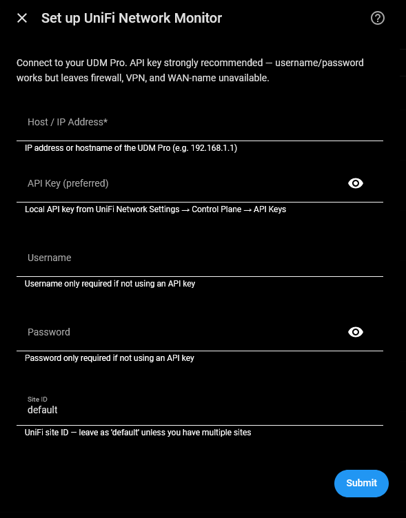

---

</details>

<br>

> [!IMPORTANT]
>
> **An API key is strongly preferred.** The UniFi Integration (v3) API endpoints are only reachable with an API key. If you authenticate with **username / password**, seven sensors covering **firewall rules, VPN connections, and WAN interface names** will be permanently unavailable (`unknown`). This is a UniFi API limitation, not a fault in the integration. The affected sensors are: Rules Active, Rules Configured, Rules Disabled, VPN Connections Active, VPN Connections Total, WAN1 Name, and WAN2 Name. Everything else works normally under either auth mode. See [FAQ](#-why-are-my-firewall-vpn-or-wan-name-sensors-unknown).

---

> [!NOTE]
>
> Setup asks for **connection details only**. Which **sensor groups** and **per-device (AP / Switch) sensors** are created is chosen **after** setup, in **Runtime Options (Configure)** just below, so you can finish setup and adjust later if you wish.

### 🔨 Runtime Options (Configure / Reconfigure)

After setup, settings can be updated by clicking the **Gear icon** ( ⚙ Configure) on the integration card:

Open **Settings > Devices & Services > UniFi Network Monitor > Configure** ( ⚙ ), or **⋮ → Reconfigure**, to set the scoping options and change connection details. Both screens present the same fields; changes take effect on submit (the entry reloads automatically). To change **Host, API Key, Username or Password**, edit them here - leaving a credential field blank means **no change**.

<details>

<summary>
&nbsp; &nbsp; ➕ &nbsp; &nbsp; Click to Expand for Details:
</summary><br>

**UniFi device (Access Point & Switch) sensors** - `Don't add` (default), `AP Satisfaction Score only`, or `Add all device sensors` (duplicates disabled).

- Leave at `Don't add` (default) unless you **know** you want additional UniFi Access Point / Switch information.
- Case 1: You **have** the core HA UniFi Network integration installed as well, but particularly want the AP Satisfaction Score that this integration provides.
- Case 2: You do **NOT** have the core HA UniFi Network integration, and want detailed info (CPU, Memory, Uptime, Clients) on your UniFi devices (e.g. Access Points and Switches).

> [!NOTE]
>
> If the official Home Assistant **UniFi Network** integration is not installed, the device-sensor choice offers only `Don't add` (default) or `Add all device sensors` (satisfaction-only requires Core present).

**Sensor groups (enable or disable):**

| Option | Effect when off |
| :-- | :-- |
| Alerts monitoring | Removes the Alerts sub-device (system-log sensors); skips the system-log poll. The `new_alert` event stops firing |
| Dual-WAN monitoring | Removes the WAN2 and load-balance entities (single-WAN setups); no separate poll (WAN2 shares WAN1's fetch) |
| Security monitoring | Removes rogue-AP, VPN, firewall, and threat-management sensors + the rogue controls; skips those polls. The `new_rogue_ap` event stops firing |
| Speedtest monitoring | Removes speedtest sensors + run buttons; skips the speedtest poll |
| WAN data-usage statistics | Removes daily/monthly data usage sensors; skips those polls |

> [!NOTE]
>
> Turning a group off **stops creating** its sensors but does **not** delete entities that already exist - they show as `unavailable` until you remove them with the **Clean Up Unused Entities** button or the `unifi_network_monitor.cleanup_unused_entities` action (see [Actions](#-actions-services)).

**Rogue-AP options:**

These three fields tune the passive rogue-AP sensors. They apply only while **Security monitoring** is on, and have no effect on the `get_rogue_aps` action, which deliberately bypasses the ignore lists.

| Option | Default | Format | What it does |
| :-- | :-- | :-- | :-- |
| **Ignore Rogue SSIDs** | _(empty)_ | Comma-separated patterns; `*` wildcard accepted (e.g. `BTWiFi, Hidden-*, MyGuest_*`) | SSIDs to drop from the rogue sensors - typically your neighbors' networks. Matching is case-insensitive. Applied when the **Apply SSID Ignore List** switch is on (**on** by default). |
| **Ignore detecting APs** | _(empty)_ | Comma-separated AP names or MACs; `*` wildcard accepted | Drops detections _reported by_ the named UniFi APs - useful when one AP in an exposed location dominates the results. Applied when the **Apply AP Ignore List** switch is on (**off** by default). |
| **Rogue history retention** | `90` days | Integer days; `0` = keep forever | How long the per-BSSID appearance history (`first_seen` / `appearances`) is kept before pruning. A hard safety cap also limits total records regardless of this value. See [Rogue AP appearance history](#-rogue-ap-appearance-history). |

Both ignore lists can also be edited from automations with the `add_rogue_ignore` / `remove_rogue_ignore` / `set_rogue_ignore` actions (see [Actions](#-actions-services)).


---

</details>

<br>

## 🔩 Under the Hood - Technical Architecture

Details on how this custom component integration is structured, in terms of use of the UniFi API; provision of actions and events; running alongside or without the official UniFi integration; self-diagnosis; data polling & validity and entity naming and validity.

<details>

<summary>
&nbsp; &nbsp; ➕ &nbsp; &nbsp; Click to Expand for Details:
</summary><br>

### 🔀 Hybrid API Model (Classic + Official v3)

The integration blends two UniFi API generations for the best data:

- **Rich telemetry** comes from the classic `/proxy/network/api/s/{site}/stat/*` endpoints (deep hardware metrics the lighter Official v3 `devices` payload omits).
- **Structured configuration** (WAN interface names, VPN tunnels, firewall rules) comes from the Official v3 / integration endpoints, fetched concurrently via `asyncio.gather()`.
- **Graceful degradation**: if the controller version doesn't support a v3 endpoint, that group degrades to `unavailable` rather than failing the whole update.

### 🎬 Actions & Events (for automations)

Beyond passive entities, the integration exposes on-demand **actions** and fire-and-forget **events**:

- **Actions** (`get_alerts`, `get_rogue_aps`) are response services - they perform their own fresh, capped fetch and return data, so they work even when the matching passive group is disabled. See [Actions](#-actions-services), and the [Scheduled Alert Digest](#-scheduled-alert-digest) / [Daily Rogue AP Digest](#-daily-rogue-ap-digest) examples.
- **Events** (`unifi_network_monitor_new_alert`, `unifi_network_monitor_new_rogue_ap`) fire once per newly-seen alert / rogue BSSID. They record the existing backlog silently on startup or re-enable (no replay), and only fire while the owning group (Alerts / Security) is enabled.

### 🤝 Coexistence with the Official UniFi Integration

This integration registers its **own separate device cards** - a Gateway device plus its sub-devices (Internet, Speedtest, Security, Alerts, Status, System) - and **never merges** with the official UniFi integration. If you run Core UniFi, it keeps its own cards; the two sit side by side. Co-existence here means **separate but aware**: Monitor doesn't share a device card with Core, but it _does_ detect when Core is installed and adjusts which sensors are enabled by default so you don't get redundant, duplicated entities.

**Gateway card:** Monitor's **Gateway** device is always its own card, showing Monitor's discovered name, model, and the Network-application firmware version - it does not adopt Core's card, name, or UniFi-OS version. The sub-devices hang off it.

**Disabled-by-default when Core is present:** to avoid duplicating what Core already provides, six gateway diagnostics - **CPU utilization, Memory utilization, CPU temperature, Board Temperature, Uptime, and Update Available** - are **created but disabled by default whenever Core UniFi is installed**, and enabled by default only when it isn't. Core surfaces the gateway's CPU, memory and temperatures - enable Monitor's on its Gateway device if you want them too. Duplicate per-device sensors are opt-in and, when created, carry a `_mon` entity-ID suffix so you can tell Monitor's copy from Core's.

### 🩺 Self-diagnosis (Integration Health)

Some failures are **silent** - a fetch succeeds but the data is wrong (e.g. a UniFi controller update renames a field and a sensor group quietly reads zero). The **Integration Health** sensor (a `problem` binary sensor on the System sub-device) watches for these:

- **`on` (moderate)** when a data source is **unavailable and you didn't disable it** - the attributes name the affected capability (e.g. _Security / Rogue APs_).
- **`on` (serious) + a Repair** when **schema drift** is detected: a non-empty response that parsed to nothing for several cycles → a `schema_drift_detected` repair suggesting you check for an integration update.

It's deliberately cautious: it **ignores capabilities you turned off**, ignores v3/firewall/VPN under username-password auth (expected), and only flags drift after it persists (no single-cycle false alarms). Details - `issues`, `severity`, `degraded_capabilities`, `drift`, `auth_mode` - live in the sensor's attributes; put it on a dashboard or alert on it to catch breakage early instead of months later. See the [Integration Health Problem Alert](#-integration-health-problem-alert) example.

### 🔄 Data Polling & 3-Strike Resilience

A custom `DataUpdateCoordinator` fetches everything per cycle and applies two resilience layers:

- **Global 3-strike** over the mandatory device/health fetches: holds last-known values for up to 3 consecutive failures before marking entities `Unavailable`; auto-recovers on the next good poll.
- **Per-endpoint resilience** for the optional endpoints: each holds its own last-good value for up to 3 failures, then only **its** entities go `unavailable` - a single flaky endpoint (or an API change) degrades one sensor group, not the whole integration.
- **Triggered refresh**: buttons (Refresh, Speedtest) request an immediate fetch for instant feedback.

### 🔄 Dynamic Polling & Standard System Options

- **Both Available**: The integration provides dynamic polling controls, to pause polling or change polling interval. It also functions normally with the standard Home Assistant **System options** > **Enable polling for changes** toggle.
- **Force-refresh on user actions**: any explicit action - Refresh Now, a speedtest run, or changing a control (interval, weight, threshold, rogue period/filters) - triggers an immediate fetch **even while Pause Polling is on**. Only _scheduled_ polling is paused.

### 🆔 Flat Identity & Stable Entities

- Gateway **MAC**, model, and firmware version are stored at setup and loaded without a network call, so device metadata is stable immediately at boot.
- **Guard bands**: numeric sensors validate against min/max limits; out-of-range readings are ignored (returned as unknown) to keep history clean.
- **`unknown` vs `unavailable`**: a value that's legitimately absent while the source is healthy reads `unknown` (e.g. Strongest Rogue RSSI with no rogues present); a stale/unreachable endpoint reads `unavailable`.

### 💾 Files Written to `config/.storage`

This integration writes **two small JSON files** per configured gateway into Home Assistant's `config/.storage` folder. They hold state that must survive a restart but doesn't belong in the config entry:

| File | What it stores | Why it exists |
| :-- | :-- | :-- |
| `unifi_network_monitor.<entry_id>.rogue_history` | Your **rogue-AP history**, keyed by BSSID: when each neighboring access point was **first seen**, how many times it has **appeared**, and its last-known SSID label. | Lets the integration tell a **genuinely new** rogue AP from one it has seen before - powering the **Rogue APs New 24h** sensor and the `unifi_network_monitor_new_rogue_ap` event, so they survive restarts instead of re-reporting every rogue as "new". Pruned by the **Rogue History TTL** option (default 90 days; `0` = keep forever) and hard-capped at 1000 BSSIDs. |
| `unifi_network_monitor.<entry_id>.usage_watermark` | A **high-water mark** for each cumulative WAN usage counter - the highest value seen so far, plus the reporting period it belongs to. | UniFi re-calculates the _current_ (open) daily/monthly usage bucket on every poll, so a byte total can drift slightly **downward** within a period. This is **normal UniFi controller behavior, not a fault in this integration or in Home Assistant** - the gateway estimates the in-progress bucket by apportioning a coarser measurement across the reporting window (the totals it reports are even fractional), and refines that estimate on each poll; verified against a live UDM Pro. This file holds each counter's running maximum so those tiny corrections never step the counter backwards, and a restart doesn't re-emit a drop. Otherwise, as these are `total_increasing` counters you would get occasional "state is not strictly increasing" log warnings. |

`<entry_id>` is Home Assistant's internal ID for your config entry - so if you've added more than one gateway, you'll see a pair of files per gateway.

**Both files are recreated automatically if deleted** - the integration does not need them to start, and neither contains credentials or configuration.

- **`usage_watermark` can be deleted without lasting impact.** It's a point-in-time snapshot; the next poll rebuilds it from whatever the controller currently reports. At worst you may see a single "not strictly increasing" warning for a usage sensor if the controller's current figure sits below what Home Assistant already recorded - it self-corrects from the next poll onward.
- **Deleting `rogue_history` loses your rogue-AP history** - every stored **first seen** date and **appearance count**. Nothing breaks, and the file rebuilds from the next poll, but the "have I seen this access point before?" knowledge is gone: **Rogue APs New 24h** resets and starts counting again from scratch. The existing rogues visible at that moment are recorded silently as the new baseline, so you won't get a flood of `new_rogue_ap` events.

**On uninstall**, both files are **deleted automatically** when you delete the integration from Home Assistant - no orphaned files are left in `.storage`. (They are keyed to the config entry's internal ID, so a re-added integration writes fresh files and never reads the old ones - which is why keeping them would serve no purpose.)

> 💡 To clear rogue history deliberately, use the **`unifi_network_monitor.clear_rogue_history`** action rather than deleting the file by hand - it does the same job cleanly while Home Assistant is running. Editing or deleting anything in `.storage` is a bad idea and not recommended.

---

</details>

<br>

## ❓ FAQ & Troubleshooting

### 🔌 Connection & Authentication

#### 🔑 **Should I use an API key or username/password?**

- **API key is strongly preferred** - it's stateless, avoids session juggling, **and it's the only auth mode that can reach the UniFi Integration (v3) API**. Username/password uses a cookie session and re-authenticates automatically on expiry, but cannot access the v3 endpoints - see the next entry.

#### 🔌 **"Failed to connect" / "Authentication failed"**

<details>

<summary>
&nbsp; &nbsp; ➕ &nbsp; &nbsp; Click to Expand for Details:
</summary><br>

- Verify the **Host** is correct and reachable from Home Assistant.
- Prefer an **API key** (UniFi OS 3.2.7+) from **UniFi Network → Integrations → Create New API Key**.
- If using **username/password**, confirm they match the credentials that you have set-up in the controller (and that they haven't been changed).
- Confirm the **Site ID** (usually `default`).
- Still stuck? See [How do I download diagnostics?](#-how-do-i-download-diagnostics) below - it also covers capturing a log when setup itself fails.

---

</details>

### 📊 Entities & Values

#### ❔ **Some sensors show "Unknown"**

<details>

<summary>
&nbsp; &nbsp; ➕ &nbsp; &nbsp; Click to Expand for Details:
</summary><br>

- Some (not all) entities showing `unknown` is **Expected Behavior**. It may be:
  - situational and transitory e.g. Strongest Rogue RSSI is `unknown` when no rogue APs are detected
  - set-up related e.g. in single WAN mode (WAN1) **ALL** WAN2 sensors will be `unknown`
  - controller / firmware related e.g. not every metric exists on every firmware/site (v3-only config sensors are `unknown` on older controllers).

---

</details>

#### 🛑 **A group of sensors shows "Unavailable"**

<details>

<summary>
&nbsp; &nbsp; ➕ &nbsp; &nbsp; Click to Expand for Details:
</summary><br>

- That endpoint has failed its retry strikes (see [Resilience](#-data-polling--3-strike-resilience)) - the rest keep working. It recovers automatically when the endpoint responds again.

---

</details>

#### ❔ **Why are my firewall, VPN, or WAN-name sensors "unknown"?**

<details>

<summary>
&nbsp; &nbsp; ➕ &nbsp; &nbsp; Click to Expand for Details:
</summary><br>

- Likely because you're authenticating with **username / password**. The seven sensors below are served exclusively by the UniFi Integration (v3) API, which is **API-key only**:
  - **Rules Active**, **Rules Configured**, **Rules Disabled** (firewall)
  - **VPN Connections Active**, **VPN Connections Total**
  - **WAN1 Name**, **WAN2 Name**
- This is a fundamental limitation of the UniFi API, not a bug. **Switch to an API key** (UniFi Network → Integrations → Create New API Key) and reload the integration to enable them.

---

</details>

#### 💻 **My gateway CPU / Memory / Temperature / Uptime sensors are disabled**

<details>

<summary>
&nbsp; &nbsp; ➕ &nbsp; &nbsp; Click to Expand for Details:
</summary><br>

- Expected **when the official HA Core UniFi integration is installed**. Six gateway diagnostics (CPU, Memory, CPU Temperature, Board Temperature, Uptime, Update Available) are disabled-by-default in that case because Core already covers the gateway - see [Coexistence](#-coexistence-with-the-official-unifi-integration). Enable any you want from the device's Entities tab. Without Core UniFi, these are enabled by default.

---

</details>

#### 🔀 **I've just installed the official UniFi integration - how do I disable the duplicate sensors here?**

<details>

<summary>
&nbsp; &nbsp; ➕ &nbsp; &nbsp; Click to Expand for Details:
</summary><br>

Manually, from the device's **Entities** tab - and note that removing and re-adding this integration won't do it for you.

This integration checks whether the official UniFi integration is present **at the moment each entity is first created**. From then on, Home Assistant owns the enabled/disabled state and remembers your choices, so installing Core UniFi later doesn't retrospectively disable this integration's overlapping sensors. That's a Home Assistant design point, not a limitation specific to this integration - and re-adding doesn't reset it either, because those choices are among the things Home Assistant restores (see the previous question).

The entities worth disabling if you now run both:

- The six gateway diagnostics - **CPU utilization, Memory utilization, CPU temperature, Board Temperature, Uptime, Update Available**.
- If you opted into per-device sensors, the AP/switch **Clients / CPU / Memory / Uptime** entities - these carry a `_mon` suffix in their entity ID specifically so you can tell them from Core's.

Select them in the Entities tab and disable. Everything unique to this integration - WAN usage, speedtests, rogue APs, alerts, internet health - has no Core equivalent and should be left alone.

The same applies in reverse: if you remove the official integration later, this one's equivalents stay disabled until you enable them.

---

</details>

#### 🧹 **I turned a sensor group off but the entities are still there (Unavailable)**

<details>

<summary>
&nbsp; &nbsp; ➕ &nbsp; &nbsp; Click to Expand for Details:
</summary><br>

- By design, options never delete automatically. Use the **Clean Up Unused Entities** button, or run `unifi_network_monitor.cleanup_unused_entities` with `dry_run: false`.

---

</details>

### 📖 General Info

#### 🚨 **What do "Sev3" and "Sev4" mean on the Alerts sensors?**

<details>

<summary>
&nbsp; &nbsp; ➕ &nbsp; &nbsp; Click to Expand for Details:
</summary><br>

- UniFi grades system-log entries by severity. This integration surfaces the **top two** - **High (Sev3)** and **Very High (Sev4)** - which match the **3-yellow-dot** and **4-red-dot** levels in the UniFi GUI. ("Sev3/Sev4" is a GUI dot-count label, not an API field.) Low (Sev1) and Medium (Sev2) are very high-volume and are **not** exposed as sensors, but the `get_alerts` action can query them on demand.
- The **Last High Sev3 / Last Very High Sev4** sensors read `None Detected` when there's no alert of that severity - that's normal, not an error.
- To act on them: the [Critical UniFi Alert (Sev4)](#-critical-unifi-alert-sev4) example notifies per Sev4 event, and the [Scheduled Alert Digest](#-scheduled-alert-digest) example summarizes both severities on a schedule.

---

</details>

#### 📡 **What's the difference between "Rogue Access Points" and "Rogue APs All 24h"?**

<details>

<summary>
&nbsp; &nbsp; ➕ &nbsp; &nbsp; Click to Expand for Details:
</summary><br>

- **Rogue Access Points** is the **curated** count: unique rogue APs after your band and ignore-list filtering, over the **Rogue Detection Period** you set. This is "what counts as a rogue right now".
- **Rogue APs All 24h** is the **raw, unfiltered** detection volume over a rolling 24 hours - every detection by every UniFi AP, ignoring all your settings and lists, and counting reporter duplicates. It's a background-**noise / coverage gauge** for trending, not a unique-rogue count.
- So All 24h is normally **higher** than the filtered count - that's expected, they measure related, but different things.
- **Rogue APs New 24h** is another related metric, similar to "All 24h" but only counting new, not seen before (B)SSIDs.
- For a readable breakdown of what's actually out there, the [Daily Rogue AP Digest](#-daily-rogue-ap-digest) example lists the rogues themselves rather than a count.

---

</details>

### 🧰 Troubleshooting Tips

#### 🐛 **How do I download diagnostics?**

<details>

<summary>
&nbsp; &nbsp; ➕ &nbsp; &nbsp; Click to Expand for Details:
</summary><br>

**Settings > Devices & Services > UniFi Network Monitor > ⋮ (three dots) > Download diagnostics.**

This is the most useful file to attach to a GitHub issue. It captures your options, the current coordinator data, and the rogue-AP history in one JSON file.

**It is redacted before it is written**, in two ways:

- **Credentials are removed outright** - API key, password, username - along with your gateway host, WAN IP addresses, ISP name, SFP serial numbers, and the user-assigned WAN interface names (which usually name your ISP).
- **Everything else identifying is pseudonymized**, not blanked. Each adopted device becomes `device-1`, `device-2`… and each nearby network becomes `rogue-1`, `rogue-2`… The same device keeps the same token everywhere it appears, so the file still makes sense to read - an alert about `device-4` can still be matched against `device-4` in the device list.

This covers MAC addresses, your device names, internal IPs, and the SSIDs of nearby networks - including where these are embedded in the free text of a captured alert.

**What deliberately stays:** hardware models, firmware versions, entity counts, health flags, signal strengths, timings, and the vendor (OUI) of detected networks.

> [!NOTE]
>
> Nearby-network detections describe **other people's** equipment. The SSID is tokenized and the BSSID redacted, but the vendor name is kept because it is genuinely useful when diagnosing rogue-AP behavior. If you would rather not share even that, remove the `oui` fields before attaching the file.

---

**If setup itself is failing**, there is no config entry yet, so there are no diagnostics to download. In that case capture a log instead - add this to `configuration.yaml` and restart:

```yaml
logger:
  default: warning
  logs:
    custom_components.unifi_network_monitor: debug
```

Logs are then visible under **Settings > System > Logs** (click **Load Full Logs**).

> [!IMPORTANT]
>
> **Log files have NO redaction of any kind** - unlike the diagnostics file above, nothing is stripped or pseudonymized. Review a log before pasting it anywhere.
>
> In practice this integration's own debug output is sparse - status messages and error text, never API response payloads - so your API key, password, session token, MACs, IPs and SSIDs are not written to it. What **can** appear is your **gateway host/IP and site ID**, because HTTP error messages quote the request URL. Other integrations logging alongside it are another matter entirely.

---

</details>

#### 🔄 **I deleted and re-added the integration for a fresh start - why did my settings and history come back?**

<details>

<summary>
&nbsp; &nbsp; ➕ &nbsp; &nbsp; Click to Expand for Details:
</summary><br>

Because Home Assistant keeps most of it on purpose. This is **Home Assistant behavior, not something this integration controls**, and for most people it's the desirable outcome: re-add the same gateway and things carry on where they left off, rather than starting from nothing.

| What | How long Home Assistant keeps it | On re-add |
| :-- | :-- | :-- |
| **Long-term statistics** (long-range graphs, Energy dashboard) | Indefinitely - these are never deleted | Continue unbroken |
| **Recent detailed history** | Your recorder retention (10 days by default) | Continues |
| **Entity IDs** (`sensor.…`) | Reused as long as nothing else has taken the name | Dashboards and automations keep working |
| Renames, icons, areas, labels, enabled/disabled state | **30 days**, in Home Assistant's entity registry | Restored |
| **Rogue-AP history** (this integration's own file) | Not kept - deleted with the integration | Starts fresh |

The **30 days** applies only to that fourth row - the entity-registry customizations. Statistics aren't on a timer at all, and your entity IDs come back either way. So re-adding after a year still reconnects your graphs; you would just need to redo any renames. Restarting Home Assistant in between makes no difference to any of this.

**If you actually wanted a clean slate**, Home Assistant doesn't really offer one - and in practice you rarely need it. Two supported options exist:

- **Developer Tools > Statistics** lists statistics whose entity no longer exists as _"There is no state available for this entity"_, and lets you delete them individually. Supported, immediate, no restart required.
- The **`recorder.purge_entities`** action drops recent history for entities you name. (It does not touch long-term statistics - use the screen above for those.)

Clearing the retained _entity-registry_ customizations is a different matter: it means hand-editing `.storage/core.entity_registry` with Home Assistant stopped. **Don't.** That single file holds the settings for every entity from every integration you run, and the risk of unintended damage far outweighs re-doing a few renames. Nothing about this integration needs it.

> [!TIP]
>
> If you're re-adding to fix a problem rather than to reset data, try **⋮ > Reload** on the integration first. It re-reads everything and re-applies your settings without removing anything.

One footnote for completeness: an entity ID is reused unless a **different, still-existing** entity has since taken that name, in which case the new one is created as `…_2` and the old statistics stay attached to the original ID. That's uncommon and generally the result of manual renaming elsewhere - it isn't something a normal remove-and-re-add causes.

---

</details>

<br>

## ❗ Known Limitations /❔ What's Missing?

<details>

<summary>
&nbsp; &nbsp; ➕ &nbsp; &nbsp; Click to Expand for Details:
</summary><br>

- **Tested hardware**: developed and tested on the **UDM Pro** only; other UniFi OS gateways are expected-compatible but unverified.
- **Firmware/endpoint variance**: available data depends on your UniFi OS / Network application version; some v3 configuration sensors require newer controllers.
- **Auth mode gates the v3 sensors**: the UniFi Integration (v3) API is API-key only. Under **username / password** auth, the seven firewall-rule, VPN-connection, and WAN-name sensors are permanently unavailable. Use an API key to enable them. See [FAQ](#-why-are-my-firewall-vpn-or-wan-name-sensors-unknown).
- **Client tracking is out of scope**: this integration monitors infrastructure. For per-client device tracking, use the **official Home Assistant UniFi integration** alongside it.
- **Data Rates**: Current upload and download data rates (i.e. MBit/s) from WAN1 and WAN2 are available from the UniFi API, but are only useful if you are polling very _frequently_. That's not part of the design scope for this integration, so it is not planned to add data rates.
- **Early/RC UniFi OS**: As with the official UniFi Integration, Early Access and Release Candidate versions of UniFi OS or the Network Application are [not supported](https://www.home-assistant.io/integrations/unifi/#software-support)

---

</details>

<br>

## ❌ Removal

To remove the integration from Home Assistant:

<details>

<summary>
&nbsp; &nbsp; ➕ &nbsp; &nbsp; Click to Expand for Details:
</summary><br>

1. Go to **Settings > Devices & Services**.
2. Find the **UniFi Network Monitor** card and click into it.
3. Click the **three dots** (⋮) next to the gear icon and select **Delete**.
4. Confirm deletion.

> [!NOTE]
>
> This integration's entities and devices are removed, along with the two [`config/.storage` files](#-files-written-to-configstorage) it created - which means your rogue-AP history is discarded.
>
> Home Assistant keeps your recorded history and entity customizations independently, so re-adding later picks up much where it left off. If that matters to you, see [why settings and history come back](#-i-deleted-and-re-added-the-integration-for-a-fresh-start---why-did-my-settings-and-history-come-back).

---

</details>

<br>

To fully uninstall (HACS):

<details>

<summary>
&nbsp; &nbsp; ➕ &nbsp; &nbsp; Click to Expand for Details:
</summary><br>

1. Go to **HACS**.
2. Find **UniFi Network Monitor** and click into it.
3. Click the **three dots** (⋮) at the top right and select **Remove**.
4. **Restart** Home Assistant.

---

</details>

<br>

## 📝 Maintenance Status

This is a **personal project**. Support and updates are provided on a **"best-effort"** basis only. While I use this integration daily and aim to keep it functional with the latest Home Assistant and UniFi releases, I cannot guarantee immediate fixes for issues or compatibility with all UniFi firmware versions.

---

## 🤝 Contributors & Acknowledgements

This integration stands on the shoulders of several excellent open-source projects:

- 🙏 [**@johntdyer**](https://github.com/johntdyer) , who, way back in 2024 provided the [original python script](https://github.com/custom-components/sensor.unifigateway/issues/59#issuecomment-1938652085) that I used and modified until deciding to make a custom component out of it. THANKS!

- 🙏 **Home Assistant Core [UniFi Network Integration](https://www.home-assistant.io/integrations/unifi/)** (@Kane610 , and contributors)

- 🙏 **[UniFi API Browser](https://github.com/Art-of-WiFi/UniFi-API-browser)** Utility (@Art-of-WiFi , and contributors): The utility that allows a UDM gateway to be explored and interrogated.

- 🙏 **[UniFi WAN](https://github.com/holdestmade/Unifi-WAN)** Custom Component (@holdestmade , and contributors): Insight into what Speedtest endpoints are available.

- 🙏 **[UniFi Network Rules](https://github.com/sirkirby/unifi-network-rules)** Custom Component (@sirkirby , and contributors): Insight into the wide range of rules information available.

- **Personal prior work**: The structure and integration architecture draw on my own custom components [ZTE Router 5G](https://github.com/PlayFaster/ha-zte-router-5g-monitor) and [WiFi SSID](https://github.com/PlayFaster/ha-wifi-ssid-monitor) Monitors.

- This project was developed with the assistance of AI to ensure code quality and adherence to best practices.

### Other Integrations

Not directly referenced but also may be of interest to UniFi users:

- 🙏 **[HA UniFi Network](https://github.com/wittypluck/ha-unifi-network)** Custom Component (@wittypluck , and contributors): If you want many of the features of the core UniFi Network integration in a separate component.

- 🙏 **[UniFi Insights](https://github.com/ruaan-deysel/ha-unifi-insights)** Custom Component (@ruaan-deysel , and contributors): If you want many of the features of the core UniFi Network **and** UniFi Protect integrations in a single integrated component.

---

## 📄 License

[](https://opensource.org/licenses/Apache-2.0)

This project is licensed under the Apache License, Version 2.0. See [LICENSE](LICENSE) for details.

---

💬 **Questions or Issues?** Visit the [GitHub repository](https://github.com/PlayFaster/ha-unifi-network-monitor).
